# OpenIPC NVR — сервер видеонаблюдения с AI-детекцией и СКУД

**Читать на другом языке:**
[English](README.en.md) · [简体中文](README.zh-CN.md) · [한국어](README.ko.md)

Сервер видеонаблюдения для распределённых IP-камер (OpenIPC, Hikvision, Dahua, Vivotek, ONVIF)
с детекцией объектов и звуков на нейросетях, распознаванием лиц и номеров,
интеграцией систем контроля доступа и веб-интерфейсом.

```
┌──────────────┐  RTSP   ┌────────────┐  HLS/WebRTC  ┌──────────────┐
│   Камеры     │────────▶│ MediaMTX   │─────────────▶│  Web UI      │
│ OpenIPC/ONVIF│         │ (медиасервер)│             │  React SPA   │
└──────────────┘         └─────┬──────┘              └──────┬───────┘
                               │                            │ REST
                    ┌──────────┴──────────┐                 │
                    │  звук камеры (AAC)  │                 │
                    └──────────┬──────────┘                 │
┌──────────────┐   NATS  ┌─────▼────────────────────────────▼───────┐
│ AI Detector  │────────▶│        Go Backend (API + логика)         │
│ YOLOv8 +     │         └────┬──────────┬───────────┬──────────────┘
│ YAMNet +     │              │          │           │
│ InsightFace  │        ┌─────▼───┐ ┌────▼────┐ ┌────▼──────┐
└──────────────┘        │PostgreSQL│ │ MinIO   │ │   СКУД    │
                        │метаданные│ │  архив  │ │Hikvision/ │
                        └──────────┘ └─────────┘ │Dahua/     │
                                                  │Promwad    │
                                                  └───────────┘
```

---

## Языки интерфейса

Интерфейс переключается между четырьмя языками: **русским, английским,
китайским (упрощённым) и корейским**. Язык по умолчанию — русский.

| Язык | Кнопка на странице «Сервер» | Состояние перевода |
|---|---|---|
| Русский | по умолчанию | язык-источник, полный |
| English | `English` | частичный |
| 简体中文 | `简体中文` | частичный |
| 한국어 (КНДР) | `한국어` | частичный, **южной нормой** — см. ниже |

### Если язык не подхватился сам

При первом открытии интерфейс берёт язык из настроек браузера: если браузер
отдаёт китайский или корейский, интерфейс откроется на нём сразу. Но бывает
иначе — браузер настроен на русский, а человеку нужен другой язык; или
браузер отдаёт язык, которого в интерфейсе нет, и показывается русский.
Тогда язык меняется вручную.

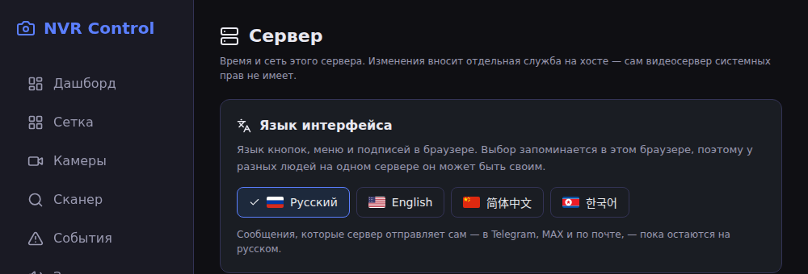

1. Откройте страницу **Сервер** — `http://<адрес сервера>:3001/server`,
   адрес тот же, по которому вы открываете интерфейс.
2. В блоке **Язык интерфейса** нажмите кнопку нужного языка. Блок стоит
   первым на странице, сразу под вводным текстом: человек, который не
   читает по-русски, до остальных настроек просто не доберётся, если не
   поймёт, что здесь написано.
3. Выбранный язык отмечается галочкой и применяется сразу — к меню,
   кнопкам и подписям на всех страницах.

Выбор запоминается в браузере, поэтому настраивать его нужно один раз.
Хранится он в браузере, а не на сервере: на одном рабочем месте интерфейс
может быть русским, на другом — корейским, и мешать друг другу они не будут.

Ещё снимки того же экрана: [по-английски](docs/screenshots/27-language-en.png),
[по-китайски](docs/screenshots/28-language-zh.png),
[по-корейски](docs/screenshots/29-language-ko.png),
[общий вид страницы](docs/screenshots/26-language-ru.png).

### Почему флаги нарисованы в коде

Флаги нарисованы вектором прямо в коде, а не взяты эмодзи и не загружаются
картинками. Причина та же, что и со словарями: сервер стоит в доме или
офисе, где интернета может не быть вовсе, и любая загрузка извне в такой
сети обернётся пустым местом вместо флага. Со шрифтами это уже случалось —
без шрифта с иероглифами весь китайский текст показывался пустыми
прямоугольниками.

### Про корейский язык

Флаг на кнопке — **КНДР**, а текст переведён **южной нормой**. Это
осознанное расхождение: заказчик сервера из КНДР, и флаг должен быть его
страны. Но северокорейская норма — не «тот же корейский с другим флагом»,
а отдельный язык перевода со своей лексикой, обращениями и терминами, и
для него нужен носитель. Заменой слов в словаре это не делается.

Как помочь с переводом, как поправить любой другой язык и как добавить
новый — [docs/TRANSLATIONS.md](docs/TRANSLATIONS.md).

---

## Возможности

| Раздел | Что реализовано |
|---|---|
| **Камеры** | Добавление и правка через веб-интерфейс (данные в PostgreSQL, без ручных конфигов), сканер подсети (ONVIF, mDNS, HTTP-зондирование, перебор учётных данных), **проверка потока до сохранения** с показом кодека, разрешения и наличия звука |
| **Потоки** | RTSP-приём через MediaMTX, HLS для браузера, WebRTC, основной и дополнительный поток, проксирование через бэкенд с JWT-авторизацией |
| **Внешний RTSP-доступ** | Выдача потоков сторонним системам (видеостены, регистраторы, аналитика) по адресам `/cameras/{N}/streaming/{main\|sub}` на отдельном порту 9784. Номера каналов назначаются автоматически, страница **Внешний доступ** показывает готовые ссылки. Потоки отдаются без перекодирования — нагрузка на камеры не растёт |
| **Звук с камер** | Прослушивание в плеере, автоматическое перекодирование G.711 → AAC (браузеры не играют G.711 в HLS), отдельная аудиодорожка, синхронная с видео |
| **Детекция объектов** | YOLOv8 с трекингом. Фильтры точности: порог уверенности, минимальный и максимальный размер объекта, отношение сторон рамки, отсечение неподвижных объектов. Настройка отдельно для каждой камеры — [docs/DETECTION-QUALITY.md](docs/DETECTION-QUALITY.md) |
| **Распознавание лиц** | InsightFace (ArcFace): эмбеддинги, справочник известных лиц, отметки «известный» / «неизвестный» / «запрещённый» |
| **Распознавание номеров** | Детекция области номера, OCR, настраиваемая зона поиска (чтобы не захватывать OSD-меню камеры), проверка формата по региону |
| **PTZ** | Поворотные камеры по ONVIF: направление, зум, стоп, пресеты, регулировка шага |
| **Управление камерами** | Настройки камеры через HTTP API прошивки (Majestic) без SSH: видео, изображение, ночной режим, OSD, перезапуск. Для камер без API остаётся SSH |
| **Камеры других марок** | Паспорт устройства прямо с камеры (модель, прошивка, серийный номер, MAC), состояние (время работы, загрузка процессора и памяти, **расхождение часов**), параметры потоков и **перезагрузка** — для Hikvision (ISAPI), Beward (фирменный HTTP API) и через общий слой ONVIF: Vivotek, Dahua, Axis, Uniview, Reolink, Xiongmai. Работает без SSH — [docs/CAMERA-VENDORS.md](docs/CAMERA-VENDORS.md) |
| **Здоровье камер** | Опрос `/metrics` и `/api/v1/sources` раз в минуту: загрузка CPU, свободная память, fps сенсора, обрывы энкодера. Оценка «норма / внимание / проблема» с пояснением причин |
| **Превью** | Кадр с камеры вместо видеопотока в списке камер: один HTTP-запрос вместо RTSP-сессии. Поддержка Basic и Digest-авторизации, резервное получение из RTSP |
| **События** | Хранение детекций от AI (класс, уверенность, bbox, трек), привязка к триггеру (объект / линия / лицо / номер), фильтры и пагинация |
| **Архив** | Запись по триггеру или постоянно, метаданные в PostgreSQL, файлы локально или в MinIO, воспроизведение в браузере, автоочистка по сроку хранения |
| **СКУД** | Адаптеры Hikvision (ISAPI), Dahua, Promwad, **IronLogic Z-5R WEB BT**: список дверей, открытие, события проходной |
| **Доступ: люди и права** | Владельцы карт (ФИО, должность, фото, отдел), группы доступа, двери, расчёт прав с указанием источника. Типы ключей: простой, мастер, блокирующий. Отдельная страница «Доступ» — [docs/SKUD-ACCESS.md](docs/SKUD-ACCESS.md) |
| **Запись карт** | Режим Accept на контроллере (дверь открывается всем, карты пишутся в память) и **считывание карты со считывателя двери** — номер попадает в интерфейс без открытия двери всем. Настольный USB-считыватель у оператора работает как клавиатура |
| **Планы помещений** | Схемы этажей с расстановкой оборудования: камеры, двери, контроллеры, считыватели на подложке (фото или скан плана). У каждой точки видно, работает устройство или нет — [docs/PLANS.md](docs/PLANS.md) |
| **Коммутаторы PoE** | Учёт управляемых PoE-коммутаторов: поиск в сети, состояние портов (связь, скорость, потребление в ваттах), **перезагрузка зависшей камеры питанием** без похода к ней. Защита от выключения транзитных портов. Привязка камер к портам — [docs/SWITCHES.md](docs/SWITCHES.md) |
| **Настройки сервера** | Единая страница: пути хранения записей и снимков, локальный диск или S3, параметры распознавания |
| **Мониторинг** | Автоматическое определение статуса камер (online/offline), восстановление путей после перезапуска медиасервера, очистка «висячих» путей |
| **Уведомления** | Telegram и MAX: события детекции со снимком или клипом, выбор камер и типов событий, порог уверенности, тихие часы, журнал отправок. Отдельно — наблюдение за сервером: пропажа камер, загрузка CPU, память, диск, перегрев и видеокарта |
| **Снапшоты** | Кадр с камеры по вендорским путям, резервное извлечение из HLS, снимки событий в ленте |
| **Мобильное приложение** | Android для телефона: выбор сервера, просмотр камер и архива. Отдельная сборка для **Android TV**: сетки от 1 до 25 камер, раскладки, звук. Подробности — [ниже](#мобильное-приложение) |

---

## Интерфейс

### Камеры и просмотр

Плитки показывают живой кадр каждой камеры, статус и адреса потоков.
Переключение `main`/`sub` прямо в плитке, отдельная кнопка удаления.

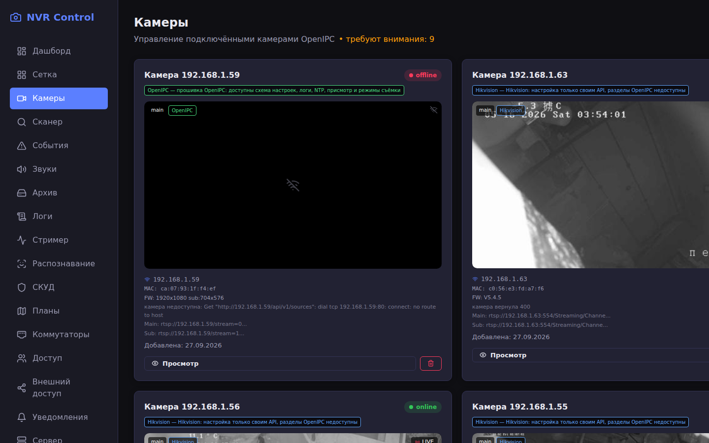

В карточке камеры — плеер с основным или дополнительным потоком,
кнопка звука и пульт PTZ для поворотных моделей.

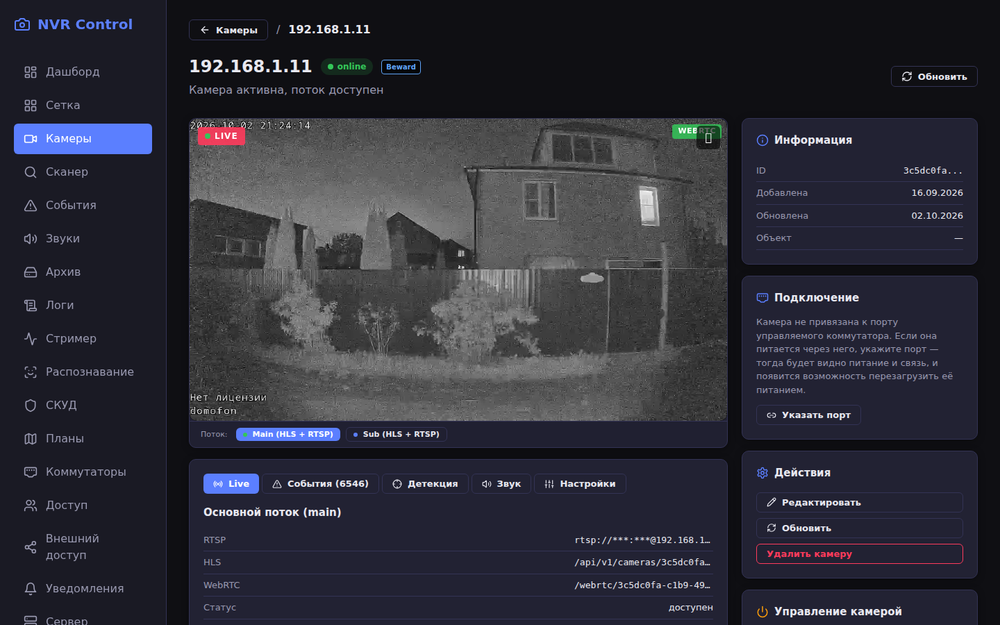

Справа от плеера — сведения об устройстве: паспорт (модель, прошивка,
серийный номер, MAC), состояние (время работы, загрузка процессора и
памяти, расхождение часов), параметры потоков и перезагрузка. Данные
читаются у самой камеры, а не из нашей базы.

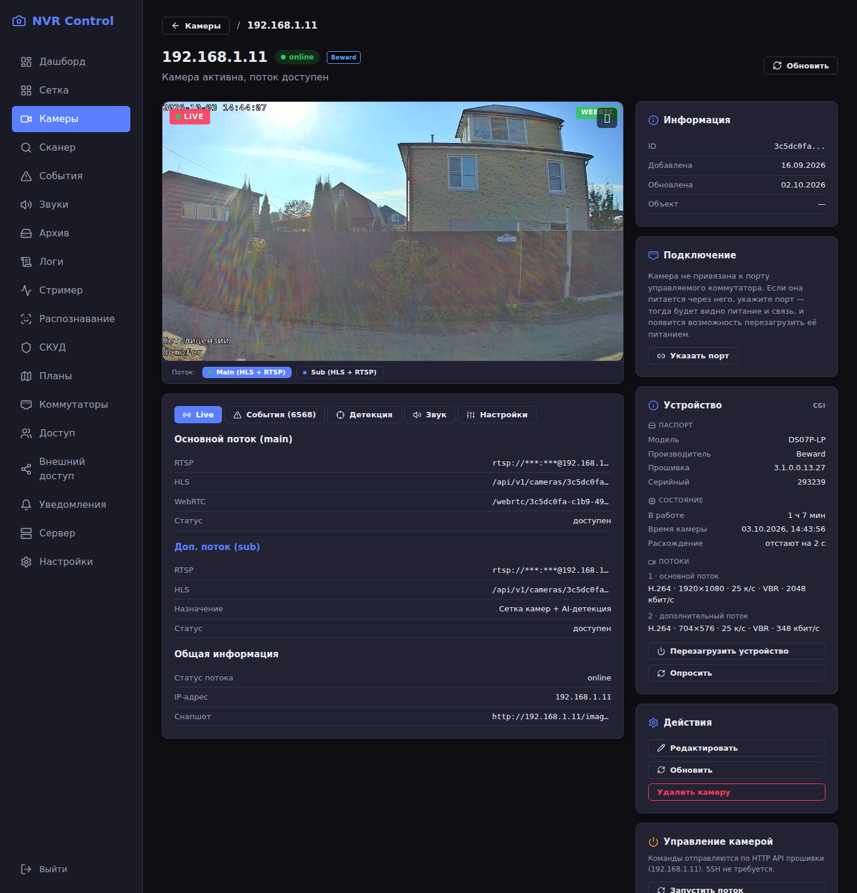

### Звук

Камера отдаёт звук в G.711, который браузеры не воспроизводят в HLS,
поэтому система перекодирует его в AAC и отдаёт отдельной дорожкой.
На панели видно кодек камеры, идёт ли перекодирование
и распознаются ли звуковые события.

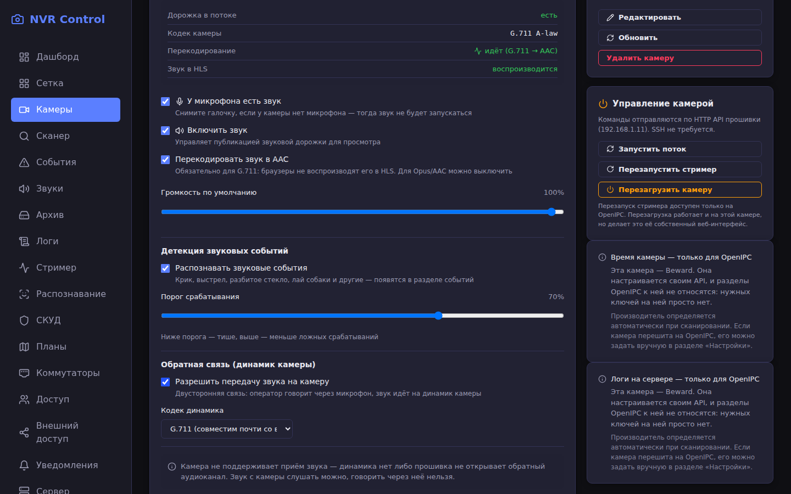

Звуковые события от YAMNet: выстрел, крик, разбитое стекло, лай собаки
и другие. Фильтры по классам и подсветка тревожных событий.

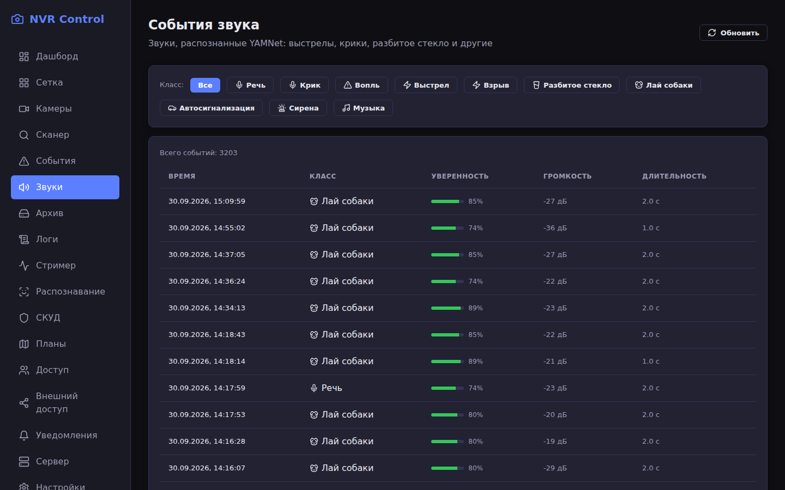

### Детекция объектов

Классы объектов, минимальная уверенность, зона поиска и линия пересечения.
Настройки применяются к конкретной камере и подхватываются детектором
автоматически, без перезапуска.

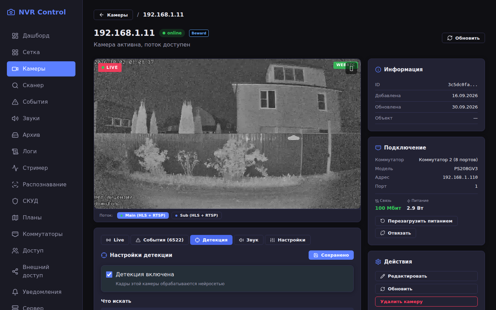

Найденные объекты заносятся в журнал со снимком, классом, уверенностью
и привязкой к камере.

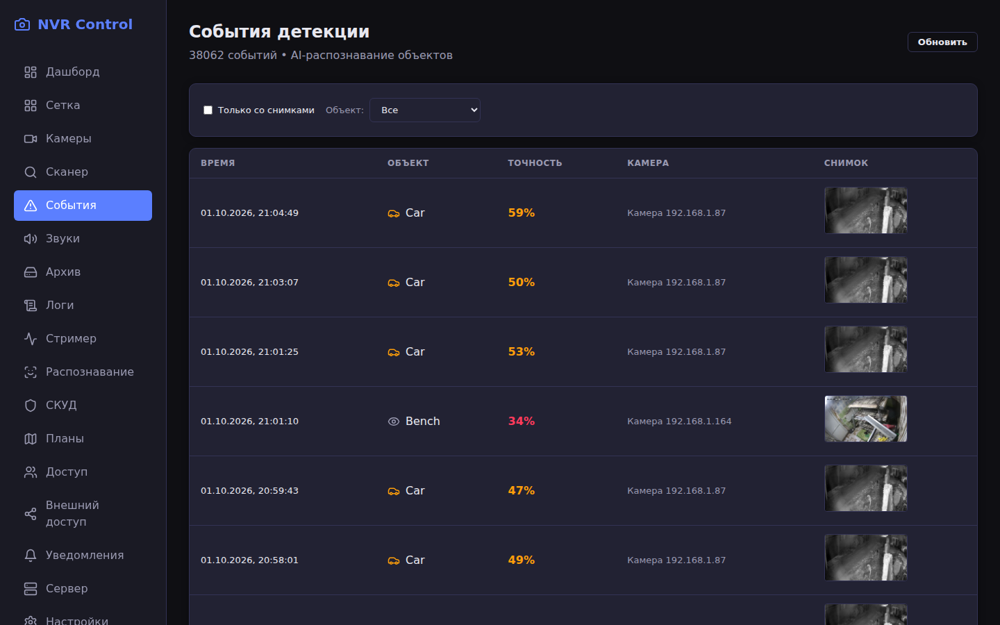

### Архив

Записи с указанием причины (объект, лицо, номер, линия, непрерывная запись),
размером, разрешением и сроком хранения. Воспроизведение прямо в браузере.

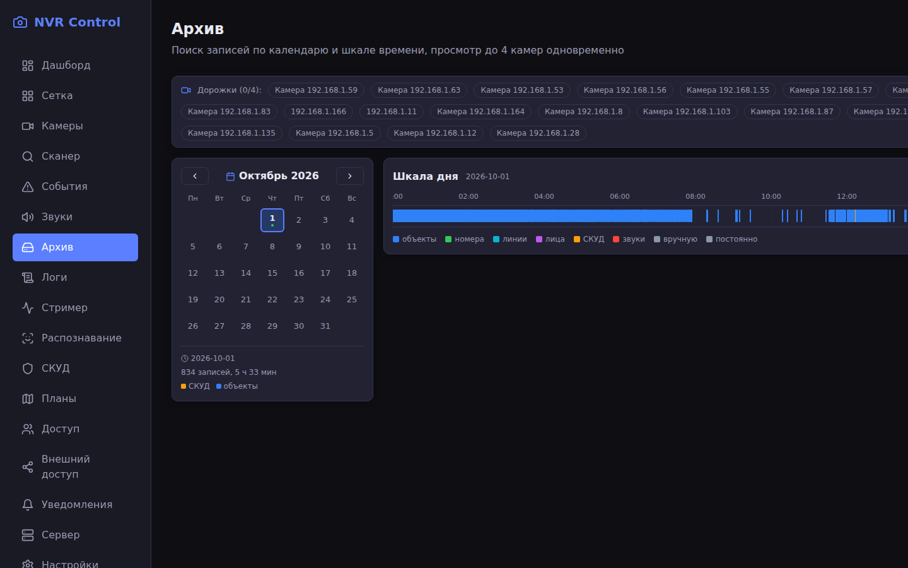

### Распознавание и СКУД

Справочники известных лиц и автомобильных номеров со статусами
«известный», «неизвестный», «запрещённый».

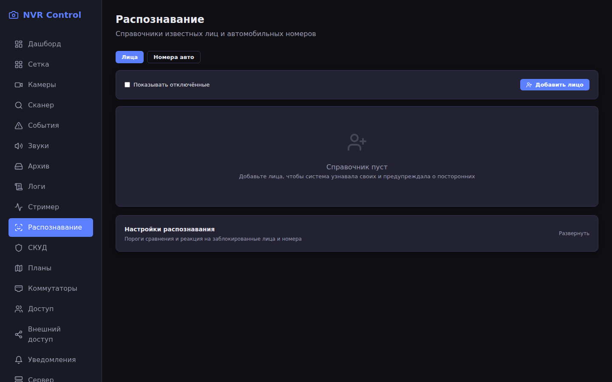

Сканер находит камеры в подсети, а перед добавлением можно проверить
поток: кодек, разрешение и наличие звука.

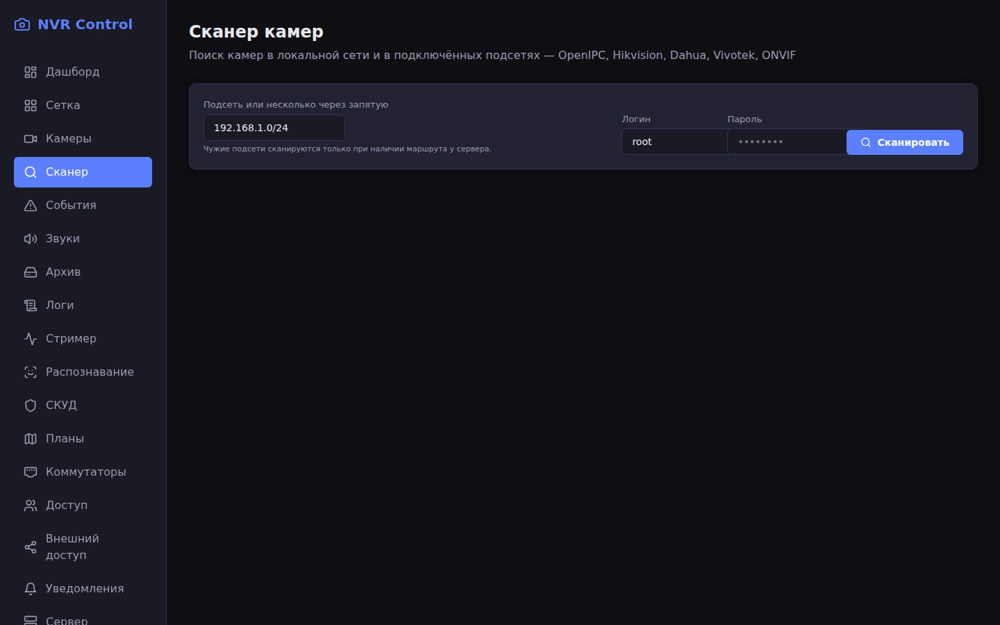

### Доступ: люди, группы и ключи

Отдельная страница «Доступ» — там люди и права, а на странице «СКУД»
осталось железо: устройства и их режимы. Оператору, который выдаёт
пропуск, не нужно разбираться в настройках контроллеров.

Права в карточке владельца показываются **как результат расчёта**, а не
как хранимые записи: у каждой двери видно, откуда пришёл доступ — из
группы или из личного правила. Иначе при разборе «у него не
открывается» непонятно, что править.

Ключи бывают трёх типов: простой пропуск, мастер (программирует
контроллер, дверь не открывает) и блокирующий (переключает режим).

Номер карты можно считать двумя способами:

* **настольный USB-считыватель** у оператора — работает как клавиатура,
  поэтому номер печатается прямо в поле формы;
* **считыватель на двери** — оператор нажимает «Ждать карту», подносит
  карту к двери, и номер появляется в интерфейсе. Дверь при этом **не
  открывается всем**: сервер только слушает события контроллера.

Подробности, включая расхождения документации вендора с живым железом —
[docs/SKUD-ACCESS.md](docs/SKUD-ACCESS.md).

### Планы помещений

Схемы этажей с расстановкой оборудования: видно, что где стоит и что
потеряло связь.

Отдельная страница, а не вкладка в списке устройств: у списка и плана
разные вопросы. Список отвечает «какие камеры есть», план — «что стоит
у этого прохода». При обходе и разборе происшествия нужен второй.

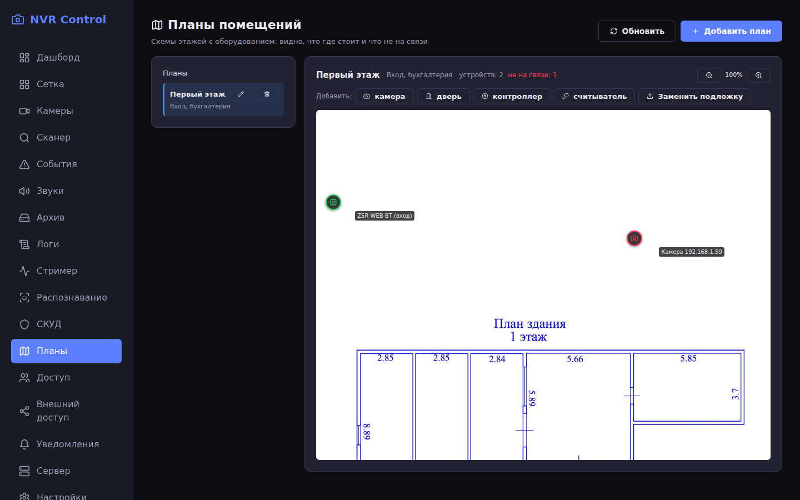

На подложку — фото или скан плана этажа — ставятся камеры, двери,
контроллеры и считыватели. Значок зелёный, если устройство работает,
красный при потере связи, серый — если устройство удалено или это
метка места без привязки. Форма значка различает вид устройства.

Координаты хранятся в долях от размера подложки, поэтому точку можно
заменить снимком другого размера — расстановка не поедет. Состояние
обновляется раз в минуту, в шапке плана видно, сколько устройств не
на связи. Подробности — [docs/PLANS.md](docs/PLANS.md).

### Коммутаторы PoE

Учёт управляемых PoE-коммутаторов и управление питанием камер.

Страница отвечает на вопрос, который список камер оставляет открытым:
почему устройство пропало. «Офлайн» не объясняет причину, а их три —
камера зависла, оборвалась линия или снято питание, — и действия
оператора в каждом случае разные.


Коммутаторы ищутся широковещательным запросом, добавляются одним
нажатием. На карточке — таблица портов: связь и скорость, состояние
PoE, потребление в ваттах, привязанная камера. Каждый порт можно
включить, выключить или перезагрузить питанием — последнее и заменяет
подъём к зависшей камере.

Зависшая камера перезагружается прямо из карточки: блок
«Подключение» сопоставляет питание, связь и состояние самой камеры и
говорит, в чём дело, а не оставляет оператора с двумя числами рядом.


Транзитные порты защищены от выключения: через них идёт канал связи с
сервером, и сняв на них питание, можно потерять управление всем
коммутатором. Каждое действие записывается в журнал с указанием, кто и
когда его выполнил. Подробности, включая различия между моделями —
[docs/SWITCHES.md](docs/SWITCHES.md).

### Настройки и обзор

Единая страница настроек: где хранить записи и снимки (диск или S3),
параметры распознавания, срок хранения.

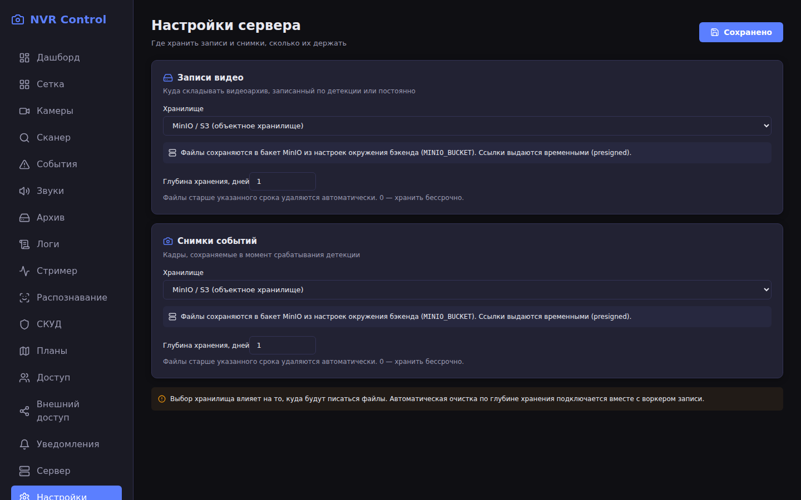

Сводка состояния системы: камеры онлайн, события за сутки, занятое место.

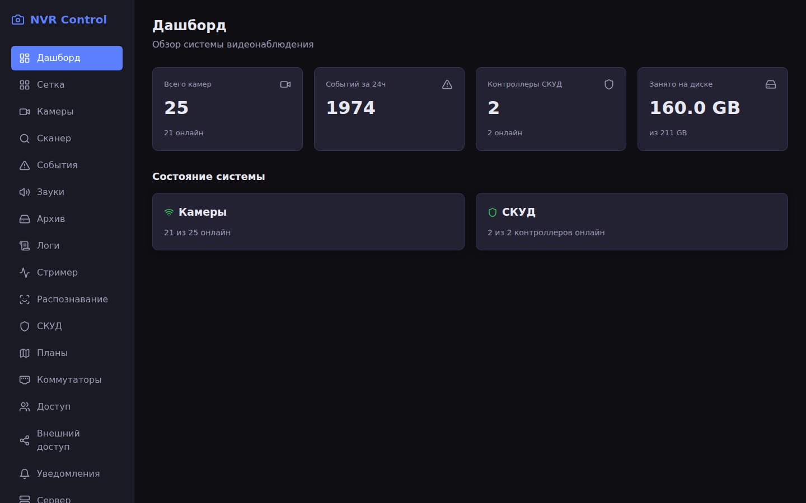

### Уведомления

События уходят в Telegram и MAX: снимок или видеоклип, выбор камер,
типов событий, порог уверенности и тихие часы. Каждый канал настраивается
отдельно, отказ одного не мешает другому.

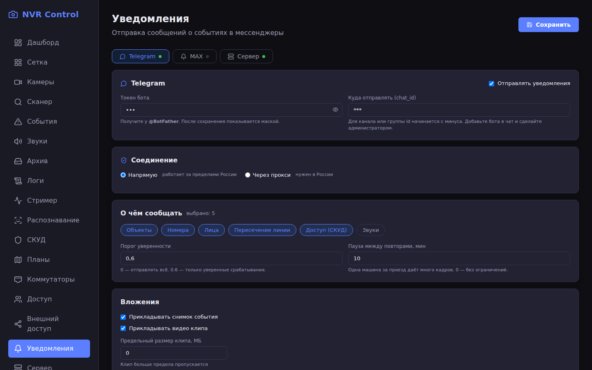

MAX — единственный канал, доступный из России напрямую, без прокси.
Rest API у него заметно строже к формату сообщений, поэтому текст
собирается отдельно от Telegram, а не переиспользуется.

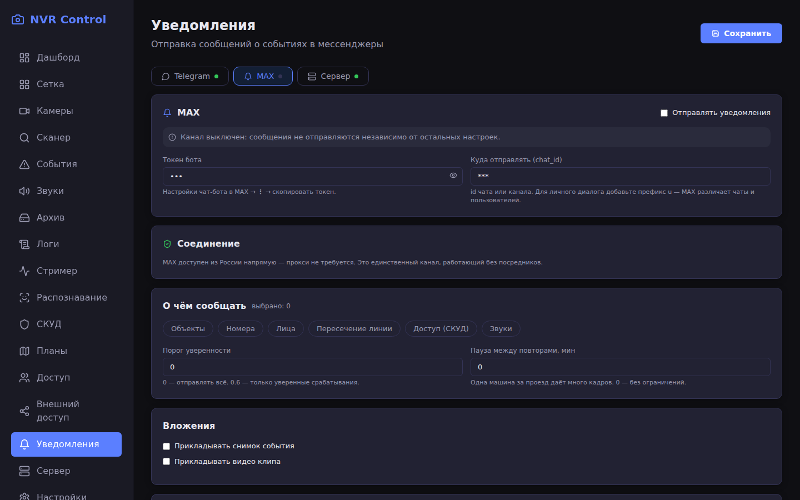

Отдельная вкладка — наблюдение за самим сервером: пропала камера, высокая
загрузка процессора, мало памяти, кончается диск, перегрев, сбой видеокарты.
Для замера температуры и видеокарты нужен агент на хосте: из контейнера
их не видно.

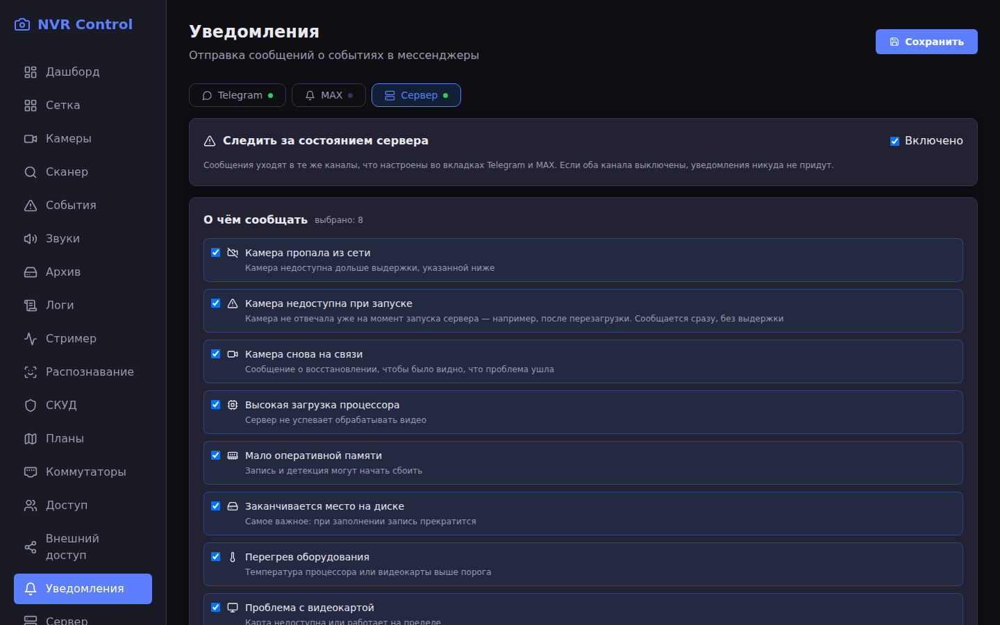

Журнал показывает, что и куда ушло, и почему что-то не ушло —
например, тип события не выбран для отправки. По нему видно состояние
доставки, не заходя в мессенджер.

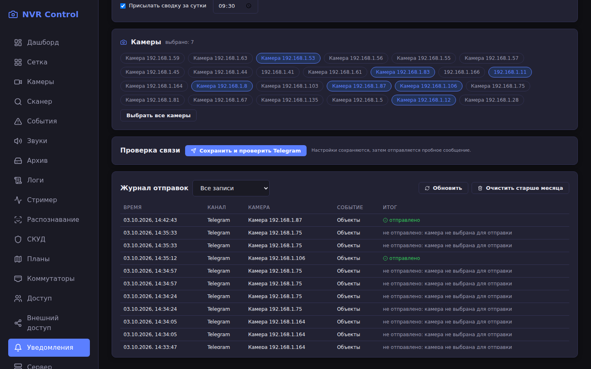

> Снимки сделаны на реальной системе. Пересоздать их можно командой
> `node scripts/make-screenshots.js` при запущенном сервере.
> Токены и адреса чатов на снимках затираются автоматически.

---

## Мобильные приложения

Одно приложение на React Native собирается в двух видах: для телефона
и для телевизора. Вид выбирается сам по типу устройства — на телевизоре
и телефонный интерфейс работал бы, но пультом по нему не попасть.

### Телефон

Подключение к серверу по IP-адресу, порту или DNS-имени, онлайн-просмотр
камер и работа с архивом.

| Экран | Возможности |
|---|---|
| **Серверы** | Список сохранённых серверов, добавление, проверка связи до сохранения, переключение, удаление |
| **Вход** | Логин и пароль; токен хранится отдельно для каждого сервера, поэтому переключение между ними не требует повторного входа |
| **Камеры** | Плитки с превью-кадрами (обновление раз в 10 секунд), статус онлайн/офлайн, обновление жестом вниз |
| **Просмотр** | Онлайн-видео по HLS, переключение основного и дополнительного потока, пауза, звук |
| **Архив** | Список записей с фильтром по камере, встроенный плеер с перемоткой, подгрузка при прокрутке. Причина записи видна сразу: номер, лицо, объект |

| Серверы | Камеры | Архив: номера | Архив: объекты |
|---|---|---|---|
| 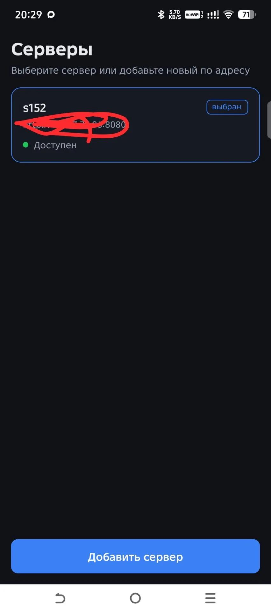 | 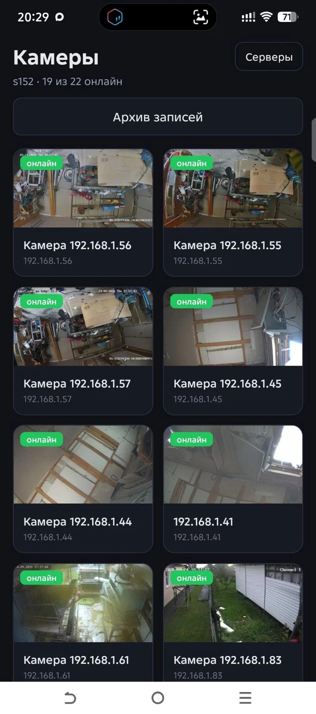 | 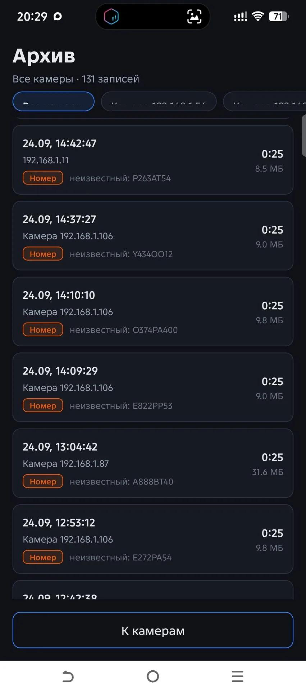 | 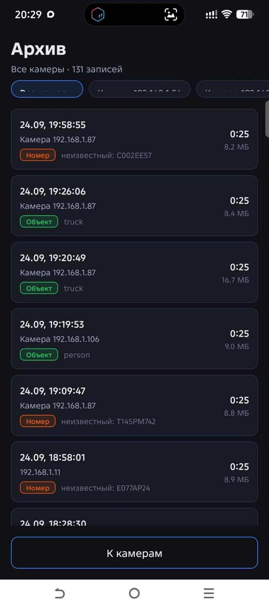 |

Счётчик рядом с именем сервера показывает, сколько камер в сети из общего
числа: на снимке 19 из 22. Камеру можно отфильтровать по адресу, а запись
открыть прямо из списка — например, «неизвестный: P263AT54».

### Android TV

Сборка для телевизора и приставки: сетка до 25 камер, раскладки и звук.
Управление пультом, плитки крупные — их видно с дивана.

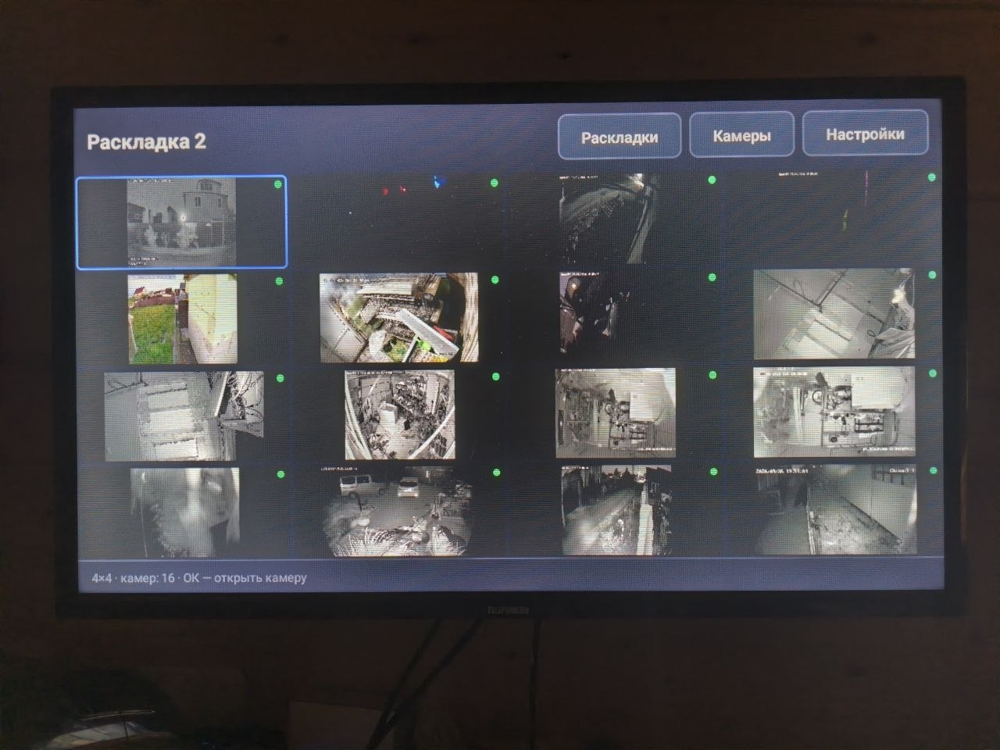

**Сетки:** 1, 2, 4, 6, 9, 16 и 25 камер. Форма подбирается под экран
телевизора, а не под квадрат: 6 камер — это 3×2, а не 2×3, иначе плитки
вытянуты по вертикали и по бокам остаются чёрные полосы.

**Раскладки:** набор камер, размер сетки, подписи и звук сохраняются под
именем («Вход», «Ночная смена») и переключаются одной кнопкой. У каждого
сервера свои раскладки. Порядок выбранных камер задаёт их место в сетке,
поэтому в списке выбора показывается номер плитки, а не галочка.

**Звук:** включается для одной камеры за раз. Звук с нескольких камер
одновременно сливается в шум, а оператору нужна конкретная.

> В плотных сетках (16 и 25 камер) подписи на плитках скрываются
> автоматически: на такую плитку приходится около сотни пикселей, и имя
> закрыло бы половину изображения. Остаётся точка состояния в углу.

Звук идёт отдельной дорожкой: MediaMTX отдаёт видео без звука, и сервер
публикует аудио отдельным потоком. В сетке играется дополнительный поток
вместо основного — четыре основных потока 4K потребовали бы больше
60 Мбит/с, чего не выдержит ни Wi-Fi телевизора, ни его декодер.

| Экран | Что делает |
|---|---|
| **Сетка** | Камеры по раскладке, фокус на плитке, открытие на весь экран или включение звука по «ОК» |
| **Раскладки** | Создание, выбор, удаление; у каждой — размер сетки и состав камер |
| **Камеры** | Выбор камер в раскладку, порядок задаёт расположение |
| **Настройки** | Подписи (имя, состояние, часы), звук, громкость, камера со звуком |

### Сборка приложений

```bash
cd mobile
npm install
echo "sdk.dir=$HOME/Android/Sdk" > android/local.properties

cd android
JAVA_HOME=/usr/lib/jvm/java-17-openjdk-amd64 ./gradlew assembleDebug
adb install -r app/build/outputs/apk/debug/app-debug.apk
```

> Требуется **JDK 17**: на JDK 21 сборка падает с ошибкой
> `jlink executable ... does not exist`.

APK собирается под обе ARM-архитектуры: `arm64-v8a` для современных
устройств и `armeabi-v7a` для приставок и телевизоров постарше. Готовый
файл — около 76 МБ. Узнать архитектуру устройства можно так:

```bash
adb shell getprop ro.product.cpu.abi
```

> Если в APK нет подходящей архитектуры, установка падает с ошибкой
> `INSTALL_FAILED_NO_MATCHING_ABIS`. Значения `abiFilters` в
> `app/build.gradle` и `reactNativeArchitectures` в `gradle.properties`
> должны совпадать: первое решает, какие готовые библиотеки попадут
> в APK, второе — под что компилируется C++ самого React Native.

**Технологии:** React Native 0.75, `react-native-video` (ExoPlayer/Media3),
TypeScript. Видео идёт по HLS через API сервера, архив — готовыми файлами MP4.

### Подключение

Адрес вводится в любом виде, приложение приводит его к одному виду:

| Ввод | Результат |
|---|---|
| `192.168.1.10` | `http://192.168.1.10:8080` |
| `192.168.1.10:9000` | `http://192.168.1.10:9000` |
| `nvr.local` | `http://nvr.local:8080` |
| `https://cam.example.com` | `https://cam.example.com` |

Кнопка **Проверить связь** обращается к `/health` сервера — ошибку в адресе
или порту видно до сохранения.

### Отличия от веб-интерфейса

В приложениях нет детекции, событий, СКУД, PTZ и настроек камер — это
инструмент просмотра и наблюдения. Управление остаётся в веб-интерфейсе.

Полное руководство: [docs/MOBILE.md](docs/MOBILE.md) — установка Android SDK,
разбор ошибки «Unable to load script», уменьшение размера APK, запуск с
hot reload.

---

## Home Assistant

Интеграция выводит камеры, события детекции и управление дверями СКУД
в Home Assistant. Вместе с ней ставится карточка панели — лента событий
с кадрами.

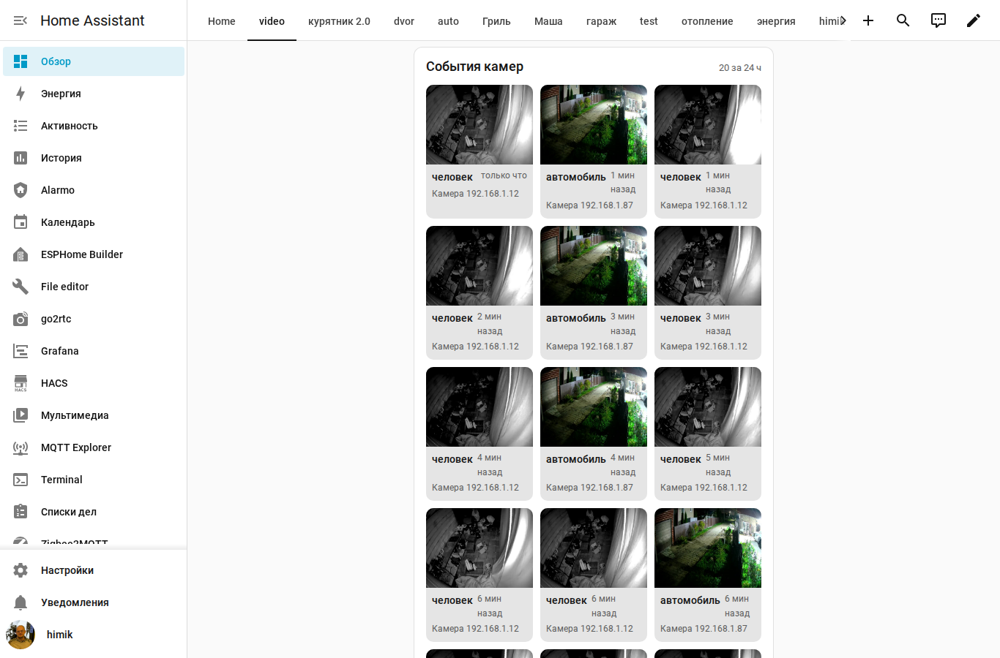

| Что | Сколько |
|---|---|
| Камеры | по одной на камеру, поток через RTSP-прокси сервера |
| Датчики движения и события | по одному на камеру |
| Кнопки камеры | запуск потока, пересоздание потока, перезагрузка |
| Кнопки дверей | по одной на дверь контроллера СКУД |
| Датчики сервера | камер на связи, событий за сутки, СКУД, диск |

События приходят **мгновенно**: сервер сам присылает их запросом на адрес
ассистента, а не ждёт очередного опроса. Запрос подписан общим секретом.

Потоки камер ассистент берёт через внешний RTSP-прокси (`9784`) — **камеры
от этого не нагружаются**, лишний читатель появляется у медиасервера.

### Установка

Через HACS: **HACS → Интеграции → Пользовательские репозитории**, добавьте
`https://github.com/himik19872/OpenIPC-NRV` с типом **Интеграция**, установите
**OpenIPC NVR** и перезапустите Home Assistant.

Вручную: скопируйте каталог `custom_components/openipc_nvr` в каталог
конфигурации ассистента и перезапустите его.

Настройка: **Настройки → Устройства и службы → Добавить интеграцию →
OpenIPC NVR**. Нужны адрес сервера, логин и пароль администратора,
а для потока — учётные данные внешнего RTSP-доступа.

Полное руководство: [docs/HOME-ASSISTANT.md](docs/HOME-ASSISTANT.md) —
разбор всех сущностей, примеры автоматизаций, настройки карточки,
просмотр архива и что делать, если не работает.

---

## Быстрый старт

### Требования

- Linux (проверено на Ubuntu)
- Docker 24+ и Docker Compose v2
- 2 ГБ ОЗУ и 10 ГБ диска минимум
- Камеры в той же сети, доступные по RTSP

### Установка

```bash
git clone https://github.com/himik19872/OpenIPC-NRV.git
cd OpenIPC-NRV

# Создаём конфигурацию и задаём секреты
cp .env.example .env
sed -i "s|^JWT_SECRET=.*|JWT_SECRET=$(openssl rand -hex 32)|" .env

# Запускаем
./scripts/nvr.sh start
```

Скрипт выведет адреса для доступа. Веб-интерфейс — `http://<IP сервера>:3001`,
вход `admin` / `admin123`.

> **Сразу смените пароль администратора.** Учётная запись создаётся сид-миграцией
> с общеизвестными данными.

### Добавление камер

1. Откройте раздел **Сканер** и укажите подсеть, например `192.168.1.0/24`.
2. Нажмите **Сканировать** — найденные камеры появятся списком.
3. Выберите нужные и добавьте: пути к потокам и учётные данные подставятся автоматически.
4. Либо добавьте вручную в разделе **Камеры**, указав `main_stream` и `sub_stream`.

Для камер OpenIPC используйте учётные данные, заданные в Majestic
(по умолчанию в проекте — `root` и пароль из прошивки).

---

## Автозапуск при загрузке

```bash
sudo ./scripts/install-service.sh
```

Создаётся служба systemd `nvr`, которая поднимает контейнеры при старте системы.
Контейнеры дополнительно имеют политику `restart: unless-stopped`, поэтому
перезапускаются после сбоев автоматически.

```bash
systemctl status nvr          # состояние службы
journalctl -u nvr -f          # логи запуска
sudo ./scripts/install-service.sh --uninstall   # удалить автозапуск
```

---

## Управление

```bash
./scripts/nvr.sh start      # запустить
./scripts/nvr.sh stop       # остановить
./scripts/nvr.sh restart    # перезапустить
./scripts/nvr.sh status     # состояние и адреса
./scripts/nvr.sh logs       # логи
./scripts/nvr.sh update     # пересобрать образы и обновить
./scripts/nvr.sh backup     # дамп базы данных в ./backups
```

---

## Документация

| Документ | Содержание |
|---|---|
| [docs/DEPLOYMENT.md](docs/DEPLOYMENT.md) | Подробное развёртывание, настройка, TLS, удалённый доступ |
| [docs/EXTERNAL-RTSP.md](docs/EXTERNAL-RTSP.md) | Выдача потоков сторонним системам: адреса, учётные данные, **принцип вывода OSD** |
| [docs/API.md](docs/API.md) | Полное описание REST API с примерами |
| [docs/DETECTION-QUALITY.md](docs/DETECTION-QUALITY.md) | Настройка точности детекции: как убрать ложные срабатывания и вернуть объект в запись |
| [docs/PLANS.md](docs/PLANS.md) | Планы помещений: схемы этажей, расстановка оборудования, состояние устройств |
| [docs/SWITCHES.md](docs/SWITCHES.md) | Коммутаторы PoE: поиск, мониторинг портов, перезагрузка камер питанием, различия моделей |
| [docs/CAMERA-VENDORS.md](docs/CAMERA-VENDORS.md) | Камеры других производителей: общий слой ONVIF, адаптер Hikvision, авторизация, проверенные возможности |
| [docs/SKUD-ACCESS.md](docs/SKUD-ACCESS.md) | Доступ: владельцы карт, группы, двери, типы ключей, работа с контроллерами |
| [docs/MOBILE.md](docs/MOBILE.md) | Android-приложение: возможности, сборка, установка, разбор ошибок |
| [docs/TRANSLATIONS.md](docs/TRANSLATIONS.md) | Переводы интерфейса: как поправить, как добавить язык, состояние корейского |
| [docs/ROADMAP.md](docs/ROADMAP.md) | План развития: CUDA-детекция, Home Assistant |
| [docs/ARCHITECTURE.md](docs/ARCHITECTURE.md) | Устройство системы, схема БД, принятые решения |
| [docs/TROUBLESHOOTING.md](docs/TROUBLESHOOTING.md) | Диагностика типовых проблем |
| [plans/](plans/) | Исходный проектный план |

Интерактивный список эндпоинтов доступен на работающем сервере:
`http://<IP сервера>:8080/api/v1/docs`

---

## Архитектура

| Компонент | Технология | Назначение |
|---|---|---|
| Бэкенд | Go 1.22, chi, pgx | REST API, бизнес-логика, управление камерами |
| Веб-интерфейс | React 18, TypeScript, Vite | SPA с плеером HLS, пультом PTZ и настройками |
| Медиасервер | MediaMTX | Приём RTSP, раздача HLS/WebRTC, запись |
| Мобильное приложение | React Native, ExoPlayer | Просмотр камер и архива с телефона и телевизора Android |
| Уведомления | Telegram Bot API, MAX Bot API | Сообщения о событиях детекции и состоянии сервера |
| AI-детектор | Python, YOLOv8, YAMNet, InsightFace | Объекты, звуки, лица, номера (GPU CUDA) |
| Шина событий | NATS JetStream | Кадры от камер к детектору, события в БД |
| База данных | PostgreSQL 16 | Камеры, события, архив, звук, справочники лиц и номеров |
| Хранилище | MinIO (S3) либо локальный диск | Видеоархив и снимки |

### Структура репозитория

```
backend/            Go-бэкенд
  cmd/server/       точка входа
  internal/
    api/            роутер и HTTP-обработчики
    service/        бизнес-логика, PTZ, SSH, сканер, звук, распознавание
    repository/     PostgreSQL и MinIO
    media/          интеграция с медиасервером
    monitor/        наблюдение за камерами и железом, пороги и напоминания
    notify/         отправка в Telegram и MAX, сборка сообщений, журнал
    nats/           подписки на события детекции и звука
    sysinfo/        опрос процессора, памяти, диска (Linux)
    tunnel/         управление WireGuard
  migrations/       SQL-миграции (001-007)
webui/              React SPA
mobile/             приложения на React Native (телефон и ТВ в одной сборке)
  src/net/          клиент API и разбор адреса сервера
  src/screens/      экраны телефона: серверы, вход, камеры, просмотр, архив
  src/tv/           телевизионный режим: сетка, раскладки, настройки
  src/storage/      сохранение раскладок и серверов на устройстве
  src/state/        выбранный сервер, токен, клиент
  android/          нативная часть: сборка APK, определение телевизора
ai-detector/        Python-сервис детекции (объекты, звук, лица, номера)
scripts/            скрипты управления и установки
docs/               документация
plans/              проектные материалы
```

---

## Разработка

### Бэкенд

```bash
cd backend
go build ./...          # сборка
go vet ./...            # статический анализ
go test ./...           # тесты
```

Локальный запуск требует PostgreSQL на `localhost:5434`:

```bash
docker compose up -d postgres minio mediamtx nats
go run ./cmd/server
```

### Веб-интерфейс

```bash
cd webui
npm install
npm run dev             # dev-сервер на :3000 с прокси на :8080
npm run build           # production-сборка
```

### AI-детектор

```bash
cd ai-detector
pip install -r requirements.txt
python frame_publisher.py --rtsp rtsp://localhost:8554/<camera-id> --camera-id <uuid>
python main.py
```

Модель `yolov8n.pt` скачивается автоматически при первом запуске.

---

## Безопасность

Перед выводом сервера в интернет:

- [ ] Сменить `JWT_SECRET` (`openssl rand -hex 32`) и `DB_PASSWORD`
- [ ] Сменить пароль администратора в веб-интерфейсе
- [ ] Сменить пароль внешнего RTSP-доступа (`MTX_EXTERNAL_PASS`) — по умолчанию `viewer`
- [ ] Закрыть порты PostgreSQL (5434), MinIO (9000/9001), NATS (4222) от внешней сети
- [ ] Настроить TLS-терминацию (nginx/Caddy) перед веб-интерфейсом
- [ ] Ограничить доступ к MediaMTX API (9997)
- [ ] Не использовать учётные данные камер по умолчанию

Подробнее — в [docs/DEPLOYMENT.md](docs/DEPLOYMENT.md).

---

## Известные ограничения

| Ограничение | Причина | Обходной путь |
|---|---|---|
| Двусторонняя связь через динамик камеры не работает | Камеры не поддерживают обратный аудиоканал: в ответе `RTSP OPTIONS` нет методов `ANNOUNCE` и `RECORD`. Конвейер реализован и заработает на камерах с такой поддержкой | Проверяется автоматически: кнопка разговора появляется только при поддержке |
| Детекция звука расходует CPU | YAMNet работает на CPU, чтобы не конкурировать с GPU за детекцию объектов | Отключить ненужные камеры или классы звуков в настройках камеры |
| WireGuard-туннели не управляются автоматически | `internal/tunnel/wg_manager.go` — заготовка, нет интеграции с netlink | Настроить пиры вручную через `wg-quick` |
| Температура и состояние видеокарты видны только через агент | Из контейнера нет доступа к датчикам и GPU хоста | Установить `host-agent` на хост: `sudo install -m 0755 agent.py /opt/nvr-agent/agent.py` |
| Корейский интерфейс переведён южной нормой, а флаг стоит КНДР | Северная норма — отдельный язык (`ko-KP`) со своими правилами и терминами, нужен носитель. Флаг при этом должен быть страны заказчика | Временная мера. Нужен перечитчик северной нормы: [docs/TRANSLATIONS.md](docs/TRANSLATIONS.md) |
| Часть сообщений об ошибках остаётся русской | Их собирает сервер из ответа устройства, а не интерфейс, и подписью они не являются | Сужается по мере переноса. Список мест: [docs/TRANSLATIONS.md](docs/TRANSLATIONS.md) |
| Китайский и корейский нуждаются в шрифте с иероглифами | Вектор рисуется всегда, а иероглифы — текст, их рисует шрифт системы | Установить Noto Sans SC / Noto Sans KR на машину, где открыт интерфейс |

---

## Что нового

### 2026-10-04 — языки интерфейса: русский, английский, китайский, корейский

**Интерфейс переключается между четырьмя языками.** Переключатель стоит на
странице настроек сервера, рядом с настройками времени и сети. Выбор
запоминается в браузере, поэтому на разных рабочих местах язык может быть
разным — сервер тут ничего не хранит.

**Языки нарисованы флагами, а картинки для них — вектором в коде.** Внешних
загрузок нет: сервер стоит в сети, где интернета может не быть вовсе, а
пустое место вместо флага — уже пройденный этап, так было со шрифтом для
иероглифов.

**Подписи интерфейса переведены полностью.** Каждая страница проверена обходом
под китайским и корейским языком: русскими остаются только имена камер и
контроллеров — их вводят люди. Запасным языком остаётся русский: если подпись
вдруг забыли перенести, пользователь увидит слово, а не ключ вида
`nav.cameras`.

**Про корейский честно.** Текст переведён **южной нормой**, а на
переключателе стоит флаг **КНДР** — по просьбе заказчика оттуда. Северная
норма — это отдельный язык со своими словами и терминами, для него нужен
носитель. Пока флаг и норма не совпадают, и это описано в
[docs/TRANSLATIONS.md](docs/TRANSLATIONS.md) вместе с инструкцией, как
поправить перевод и добавить новый язык.

### 2026-10-03 — домофон Beward в СКУД: открытие двери с журналированием

**Домофон заведён в СКУД как устройство доступа.** У DS07P-LP есть реле
замка и кнопка вызова, а журнал проходов, съёмка по событию и запись видео
в разделе СКУД уже есть — поэтому домофон описан там, а не рядом с
камерами.

**Как включено на объекте.** Реле домофона подключено к входу «кнопка
выхода» контроллера Z5R.

**Что это значит для журнала — и есть главная причина такой схемы.**
Открытие с домофона выглядит для Z5R нажатием кнопки выхода, а не
проходом по карте. В событиях СКУД такие записи уже есть:
`event_type=exit_button`. По ним **нельзя понять, кто открыл дверь и
откуда** — с домофона, из веб-интерфейса Z5R или настоящей кнопкой у
двери. Все три случая неразличимы. Поэтому журнал ведём у себя: только так
остаётся след о том, что дверь открыта домофоном.

**Одно открытие даёт две записи** — нашу с причиной и `exit_button` от
Z5R. Это не два прохода, а одно действие, увиденное с двух сторон.

**Состояние двери показывается как «неизвестно», и это честно.**
Устройство сообщает только тревоги, и на проверенном экземпляре всегда
отвечает `NO Alarm`. Положение двери прочитать нельзя. Показать «заперто»
без знания — та же ошибка, что была с часами камеры, показывавшими
«точно» при непрочитанном времени.

**Что проверено на живом устройстве:** связь (контроллер `online`) и
список дверей. **Открытие двери не проверялось** — проверка означает
открыть реальную дверь. Адрес и параметры команды выверены по описанию
интерфейса и покрыты проверками на подставном устройстве.

**SIP и звук уже настроены на объекте** и нами пока не используются:
регистрация на SIP-сервере, вызовы на два номера, цифры во время
разговора замыкают реле. Двусторонний звук со стороны устройства включён
(`DoubleAudio=on`) — микрофон и динамик отдаются в RTSP-поток, который мы
и так принимаем.

Подробности — [docs/SKUD-ACCESS.md](docs/SKUD-ACCESS.md).

### 2026-10-03 — камеры Beward: фирменный HTTP API

**Производитель передал полное описание интерфейса** — 219 страниц, 63
разных адреса. Оно покрывает всю настройку устройства, и это на порядок
больше того, что даёт ONVIF.

**Для Beward основным способом выбран фирменный API, ONVIF — запасным.**
ONVIF на этих устройствах работает, но времени работы не сообщает вовсе.
Фирменный API сообщает, и теперь в карточке видно, когда устройство
загружалось в последний раз. Плюс фирменный интерфейс остаётся доступен,
если ONVIF на устройстве выключат.

**Авторизация — Digest, с запасным Basic.** Описание допускает оба
способа; без запаса устройство, настроенное на Basic, оказалось бы
недоступным.

**Найдены две ошибки, и вторая опаснее первой.** Время устройства
разбиралось как всемирное и пересчитывалось в местное — показания уезжали
на смещение пояса, и часы домофона показывали `17:24` вместо `14:24`.
Собирать время надо заново в местной зоне, а не пересчитывать момент.

Вторая вскрылась на снимке экрана: когда часы прочитать не удалось,
карточка показывала «01.01.1» — выдуманную дату, — а расхождение выводила
как **«точно»**. То есть отсутствие данных превращалось в утверждение, что
часы камеры верны, и оператор не пошёл бы проверять то, что ему
подтвердили как исправное. Теперь пропущенные данные так и выглядят —
строки просто нет, как и с битрейтом по ONVIF.

**Сверка двух источников.** Отдельного поля с серийным номером в ответе
нет, но `DeviceID` им является: то же устройство сообщает по ONVIF ровно
это значение (`293239`). Это проверка, а не догадка.

**Распознавания лиц у этой модели нет.** Раздел в описании есть, но
`facecfg_cgi` отвечает `404`: набор возможностей зависит от модели, а не
от версии описания.

**Выяснилось, почему ONVIF работает на Beward, но не на Hikvision.** На
Beward он включён с завода (`root.Properties.API.ONVIF.ONVIF=yes`), а на
камерах Hikvision его не включали и ONVIF-пользователя не создавали.

Подробности — [docs/CAMERA-VENDORS.md](docs/CAMERA-VENDORS.md).

### 2026-10-03 — камеры других производителей: общий слой ONVIF и Hikvision

**Паспорт и состояние прямо с камеры.** На карточке камеры появился блок
**Устройство**: модель, прошивка, серийный номер, MAC, время работы,
загрузка процессора и памяти, параметры потоков. Данные читаются у самой
камеры, а не из нашей базы — расхождение с записанным и есть повод для
внимания.

**Перезагрузка без SSH.** Кнопка на карточке устройства с подтверждением.
Проверено на живых камерах: возвращаются через 80 секунд (Hikvision) и
60 секунд (Vivotek).

**Два уровня доступа.** Общий ONVIF — один код на все марки, и фирменный
адаптер Hikvision (ISAPI) там, где общий язык отдаёт меньше.

**Почему Hikvision не через ONVIF.** На камерах парка ONVIF отказал:
предварительные вызовы проходят, а требующие авторизации отклоняются с
«sender is not authorized». Причина не в коде — на камере не включён ONVIF
и не создан ONVIF-пользователь, веб-пользователь им не является. HTTP
Digest с тем же паролем работает сразу.

**Расхождение часов видно в интерфейсе.** На камере `192.168.1.63` часы
отстают на **139 суток** — это видно прямо в карточке. Раньше о таком
можно было узнать только по сдвинутым меткам архива.

**Найдены и исправлены три ошибки:**

* Знак расхождения часов был перепутан: положительное значение означало
  отставание, а показывалось как «спешат». Проверено на камере с
  отставанием в 139 суток.
* Кнопка перезагрузки показывалась там, где заведомо вернула бы отказ:
  проверка возможности стояла после утверждения типа, которое у цепочки
  адаптеров срабатывает всегда.
* Адрес службы медиа брался у камеры как есть. Для камеры за туннелем там
  записан её внутренний адрес — обращение уходило в никуда при полностью
  исправном устройстве. Теперь подменяется только хост, порт и путь
  сохраняются.

**Авторизация вынесена в общий пакет** `internal/httpdigest` — с
восстановлением тела запроса перед повтором. Перезагрузка Hikvision
требует непустое тело, и без восстановления команда молча не срабатывала
бы.

Подробности — [docs/CAMERA-VENDORS.md](docs/CAMERA-VENDORS.md).

### 2026-10-02 — определение привязки камер по таблице MAC

**Привязка камер к портам определяется автоматически**

Коммутатор ведёт таблицу MAC-адресов и сообщает, через какой порт виден
каждый адрес. Система сопоставляет эти адреса с базой камер и сама
предлагает привязку — вручную указывать порт больше не нужно.

- Страница коммутатора показывает все устройства на портах, включая те,
  которых нет среди камер: это помогает найти лишнее оборудование
- Кнопка «Определить привязки камер» находит совпадения и показывает,
  что изменится
- Устройства за транзитным портом помечаются отдельно: они подключены не
  к этому коммутатору, и привязывать их сюда нельзя

Правила отбора намеренно узкие, потому что цена ошибки высока — неверная
привязка приводит к перезагрузке питания не той камеры. Предложение
делается, только если адрес виден ровно с одного порта PoE и принадлежит
ровно одной камере проекта.

**Модели ведут себя по-разному, и это видно в интерфейсе**

Различаются три случая: порты сообщаются (привязка автоматическая),
таблица есть но без портов (привязка вручную), команда не поддерживается.
На живом парке встретились все три, причём на одном коммутаторе прошивка
отдаёт одинаковую маску всем записям, включая устройства на собственных
портах.

**Исправлена нумерация портов**

Правило разворота взято из веб-интерфейса самих коммутаторов и
подтверждено на двух моделях. Прежняя версия разворачивала список портов
целиком, тогда как устройство разворачивает **только порты PoE**, а
транзитные оставляет в конце. На GPS204V3 это означало, что команда,
адресованная порту 1, попадала на транзитный порт — через который идёт
канал связи с сервером.

Правило снято не догадкой: в интерфейсе GPS204V3 набор `portIndex` равен
`[3,2,1,0]` при четырёх портах PoE, у PS208GV3 — `[0..7]`.

> **При обновлении:** исправление меняет смысл уже сохранённых привязок на
> моделях с обратным порядком. Проверьте привязки, созданные ранее.

**Проверено на живых устройствах**

Цепочка целиком: система определила камеру на порту 1, перезагрузка этого
порта выключила именно её, камера вернулась в таблицу на том же порту
после подачи питания.

### 2026-10-02 — управление PoE-коммутаторами

**Учёт коммутаторов и мониторинг портов**

Отдельная страница: поиск коммутаторов в сети, состояние портов, журнал
действий. Поддержаны управляемые PoE-коммутаторы SSCPOE — проверено на
PS204, PS208GV3 и GPS204V3.

- Поиск широковещательным запросом: адрес знать заранее не нужно,
  идентификатором служит серийный номер
- Таблица портов: связь и скорость, состояние PoE, **потребление в
  ваттах**, переданный и принятый объём, привязанная камера
- Опрос раз в минуту фоновый, состояние доступно и без открытого
  интерфейса

**Перезагрузка зависшей камеры питанием**

Камера, переставшая отвечать, перезагружается нажатием кнопки —
подниматься к ней не нужно. Цикл питания проверен на живых устройствах:
порт обесточивается, выдерживается пауза и питание подаётся снова.

**Привязка камер к портам**

В карточке камеры видно, к какому коммутатору и порту она подключена.
Блок сопоставляет питание на порту, наличие связи и состояние самой
камеры и выдаёт вывод:

- питание и связь есть, камера молчит — зависла, поможет перезагрузка
- питание есть, связи нет — обрыв линии, перезагрузка не поможет
- питания нет — камера обесточена

**Защита от опасных действий**

- Транзитные порты выключить нельзя: через них идёт канал связи с
  сервером, и сняв на них питание, можно потерять управление всем
  коммутатором
- Порты без поддержки PoE не принимают команды питания
- Привязка к несуществующему порту отвергается
- Действия с питанием требуют подтверждения

**Различия моделей, выясненные на живом оборудовании**

Одна линейка ведёт себя по-разному, и это учтено:

- часть моделей отдаёт состояние без авторизации, часть требует пароль;
  требование входа — отдельное состояние, а не «нет связи»
- температура лежит в разных полях, причём на одной из моделей в
  «температурном» поле приходит постороннее число
- число портов и число портов с PoE различаются: на GPS204V3 портов
  шесть, а питание есть только на четырёх
- порядок нумерации портов у части моделей обратный; признак хранится в
  настройках и может быть исправлен вручную, потому что ошибка здесь
  означает команду не на тот порт

**Пароли камер убраны из скриншотов**

Обнаружено, что на снимки интерфейса попадал адрес потока вида
`rtsp://admin:пароль@…` — то есть учётные данные камеры в открытом виде
в публичной документации. Теперь скрипт снимков затирает пару
логин:пароль в адресах потоков для **каждого** кадра, а не по выбору
автора записи.

Если вы публиковали этот проект, смените пароли камер: старые версии
снимков остаются в истории git.

### 2026-09-26 — уведомления, приложения для телефона и Android TV

**Уведомления в Telegram и MAX**

События уходят в мессенджеры со снимком или видеоклипом. Проверено
на реальной работе: доставка, вложения, журнал отправок.

- События детекции: объекты, номера, лица, пересечение линии, СКУД, звуки
- Выбор камер и типов событий для каждого канала отдельно
- Порог уверенности, пауза между повторами, тихие часы
- Сводка за сутки в заданное время
- Журнал отправок: что ушло, что нет и почему
- Отказ одного канала не блокирует другой: если Telegram недоступен,
  MAX продолжает работать
- **MAX** — второй канал для России: доступен напрямую, без прокси.
  Для него собирается отдельный текст сообщения: API MAX строже
  к разметке и не принимает сообщения Telegram как есть

**Наблюдение за сервером и камерами**

Отдельная вкладка отвечает на вопрос «что считать проблемой», а не
«куда отправлять»: сообщения уходят в те же каналы.

- Камера пропала из сети — с выдержкой, чтобы не тревожить на перезагрузке
- Камера недоступна при запуске сервера — сообщается сразу
- Камера снова на связи — видно, что проблема ушла
- Высокая загрузка процессора, мало оперативной памяти, кончается диск
- Перегрев оборудования и проблемы с видеокартой
- Повторные напоминания, пока проблема не устранена, и тихие часы
- Температуру и видеокарту измеряет агент на хосте: из контейнера
  их не видно

**Время уведомлений**

Время в сообщениях было в UTC: в образы не пробрасывался часовой пояс
хозяйской машины. Теперь `/etc/localtime` монтируется во все контейнеры,
а PostgreSQL дополнительно получает `TZ` и `PGTZ` — часовой пояс он берёт
из каталога данных, и одной примонтированной зоны ему мало.

**Приложение для телефона**

- Просмотр камер с превью-кадрами и статусом онлайн/офлайн
- Архив с причиной записи: номер, лицо, объект — видно из списка
- Звук с камер
- Отдельный токен на каждый сервер: переключение серверов
  не требует повторного входа

**Приложение для Android TV**

- Сетки от 1 до 25 камер, форма подбирается под экран телевизора
- Раскладки с именами: состав камер, размер сетки, подписи, звук
- Звук для одной камеры за раз
- Управление пультом, крупные элементы под расстояние до экрана
- В плотных сетках подписи скрываются сами: в мелкой плитке
  они закрывают изображение

---

### 2026-09-22 — внешний RTSP-доступ, управление камерами без SSH, превью кадрами

**Внешний RTSP-доступ**

Выдача потоков сторонним системам: видеостенам, регистраторам, сторонней
аналитике. Внешние потребители берут поток у NVR и не подключаются к
камерам напрямую — это снимает нагрузку с устройств, которые
ограничивают число одновременных RTSP-сессий.

- Адреса `/cameras/{N}/streaming/{main|sub}` на отдельном порту `9784`
  (номер канала со смещением на минус один: канал 1 → `cameras/0`)
- Отдельная авторизация: внешним системам доступно только чтение,
  внутренние потребители работают как прежде
- Потоки **без перекодирования** — нагрузка на процессор не растёт
- Страница **Внешний доступ**: параметры подключения, готовые ссылки
  с копированием, состояние каналов
- Автоматическое назначение номера канала при добавлении камеры
- Подробности — в [docs/EXTERNAL-RTSP.md](docs/EXTERNAL-RTSP.md)

**Управление камерами без SSH**

- Настройки камеры через HTTP API прошивки (Majestic): видео (fps,
  битрейт, кодек, размер кадра), изображение (яркость, контраст,
  насыщенность, зеркало), ночной режим, OSD
- Отправляются только изменённые поля — остальные настройки камеры
  не затрагиваются
- Проверка значений до записи: камера слабая, и неверный битрейт
  роняет поток
- Перезапуск камеры через API вместо SSH
- Поддержка двух сборок прошивки с разными наборами эндпоинтов
- Для камер без API остаётся SSH

**Здоровье камер**

- Опрос `/metrics` и `/api/v1/sources` раз в минуту
- Показатели: загрузка CPU, свободная память, fps сенсора, обрывы
  кадров энкодера, ночной режим
- Оценка «норма / внимание / проблема» с пояснением причин
- Показатели видны в списке камер и в карточке камеры

**Превью кадрами вместо потока**

- В списке камер кадр вместо HLS-потока: один HTTP-запрос вместо
  RTSP-сессии, что заметно дешевле для парка камер
- Уменьшение кадра на сервере: 4K → 480 точек (470 КБ → 17 КБ)
- Поддержка Basic и Digest-авторизации, вендорских путей кадра
- Резервное получение кадра из видеопотока, если HTTP-эндпоинта нет
- Очередь запросов: одновременно опрашивается не более трёх камер

**Прочее**

- Показ OSD-надписей в потоке задокументирован: метка встраивается
  камерой и одинакова для архива, браузера и внешних систем
- Убраны временные отладочные логи восстановления потоков

---

### 2026-09-19 — звук, распознавание, управление камерами

**Звук с камер**
- Прослушивание звука в плеере: отдельная аудиодорожка, синхронная с видео
- Перекодирование G.711 → AAC: браузеры не воспроизводят G.711 в HLS
- Перенаправление звука в отдельный поток MediaMTX, видео при этом не затрагивается

**Детекция звука**
- YAMNet (521 класс AudioSet): выстрел, крик, вопль, разбитое стекло, взрыв, лай, сирена, автосигнализация, речь, музыка
- Настройка порога, классов и кулдауна для каждой камеры
- Отсечение тишины по громкости — защита от ложных срабатываний на шуме микрофона
- Раздел **Звуки** в интерфейсе: фильтры по классам, тревожные события подсвечены

**Распознавание лиц и номеров**
- Справочники известных лиц и номеров, отметки «известный» / «неизвестный» / «запрещённый»
- Настраиваемая зона поиска номера — OCR больше не захватывает OSD-меню камеры
- Проверка формата номера с учётом региона

**Архив и запись**
- Запись по триггеру (объект, линия, лицо, номер) или постоянно
- Указание триггера в имени файла — понятно, почему началась запись
- Воспроизведение в браузере, выбор хранилища (локальный диск или S3)

**Управление камерами**
- Полное управление через веб-интерфейс: данные в PostgreSQL, без ручных конфигов
- Проверка потока до сохранения: кодек, разрешение, наличие звука
- Автозаполнение IP из RTSP-адреса
- Правка IP и пароля автоматически обновляет пути медиасервера
- Кнопки перезапуска камеры и её стримера
- Камеры без микрофона и динамика определяются автоматически

**GPU-ускорение**
- Детекция на CUDA (NVIDIA P104-100): ~13 мс на кадр против 83 мс на CPU

---

## Лицензия

Проект распространяется «как есть» для задач видеонаблюдения.
Сторонние компоненты сохраняют собственные лицензии (MediaMTX — MIT,
YOLOv8 — AGPL-3.0, MinIO — AGPL-3.0, PostgreSQL — PostgreSQL License).
