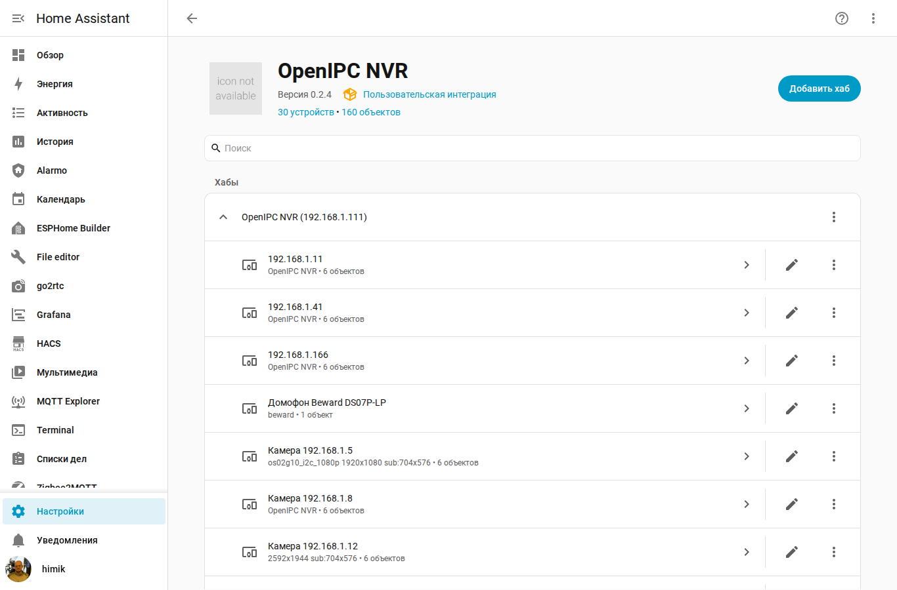
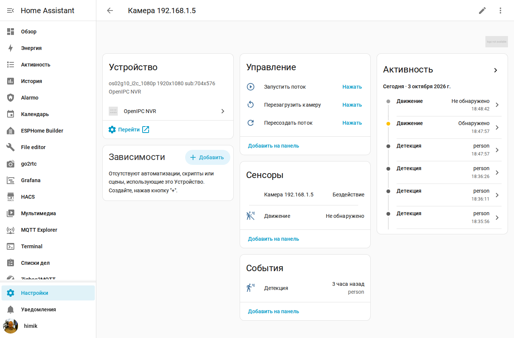
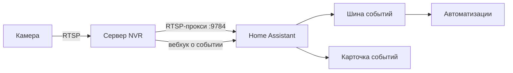

# Интеграция с Home Assistant

Интеграция выводит в Home Assistant камеры, события детекции и управление
дверями СКУД нашего сервера видеонаблюдения. Вместе с ней ставится карточка
панели — лента событий с кадрами.



---

## Содержание

1. [Что даёт интеграция](#1-что-даёт-интеграция)
2. [Установка](#2-установка)
3. [Настройка](#3-настройка)
4. [Сущности](#4-сущности)
5. [События и автоматизации](#5-события-и-автоматизации)
6. [Карточка событий](#6-карточка-событий)
7. [Просмотр архива](#7-просмотр-архива)
8. [Как это устроено](#8-как-это-устроено)
9. [Если что-то не работает](#9-если-что-то-не-работает)

---

## 1. Что даёт интеграция

| Что | Сколько | Зачем |
|---|---|---|
| Камеры | по одной на камеру | Плитка с живым потоком через RTSP-прокси сервера |
| Датчики движения | по одному на камеру | Сработала детекция; держится 45 секунд |
| События | по одному на камеру | Последнее срабатывание с типом объекта |
| Кнопки камеры | по три на камеру | Запустить поток, пересоздать поток, перезагрузить камеру |
| Кнопки дверей | по одной на дверь | Открыть дверь СКУД |
| Датчики сервера | шесть | Камер на связи, событий за сутки, СКУД, занято и свободно на диске, последние события |
| Карточка панели | одна | Лента событий с кадрами |

Потоки камер не нагружают сами камеры: ассистент подключается к внешнему
RTSP-прокси сервера (порт `9784`), а тот отдаёт уже готовый поток. Камера
при этом обслуживает только сервер, независимо от того, сколько систем
смотрят поток через прокси.

---

## 2. Установка

### Через HACS

1. Откройте **HACS → Интеграции**.
2. Меню (три точки) → **Пользовательские репозитории**.
3. Добавьте адрес `https://github.com/himik19872/OpenIPC-NRV`, тип —
   **Интеграция**.
4. Найдите в HACS **OpenIPC NVR** и установите.
5. Перезапустите Home Assistant.

### Вручную

Скопируйте каталог `custom_components/openipc_nvr` из этого репозитория
в `<каталог конфигурации>/custom_components/` и перезапустите Home Assistant.

**Обновите страницу браузера после перезапуска.** Файл карточки подключён
к панели с номером версии в адресе, и старый файл остаётся в кэше браузера.
Без обновления страницы карточка может остаться прежней.

### Требования

- Home Assistant 2025.1 или новее.
- Сервер видеонаблюдения доступен из сети ассистента.
- Для живого видео включён внешний RTSP-доступ на сервере (порт `9784`).

---

## 3. Настройка

**Настройки → Устройства и службы → Добавить интеграцию → OpenIPC NVR.**



| Поле | Что вводить |
|---|---|
| Адрес сервера | Адрес сервера видеонаблюдения, например `192.168.1.111` |
| Порт API | `8080`, если на сервере не меняли |
| Логин | Учётная запись сервера, обычно `admin` |
| Пароль | Пароль этой учётной записи |
| Смотреть поток через RTSP-прокси | Оставьте включённым, если не уверены |
| Логин RTSP | Учётные данные внешнего RTSP-доступа, обычно `viewer` |
| Пароль RTSP | Пароль внешнего RTSP-доступа |

Вход проверяется сразу при добавлении. Если логин или пароль неверны,
интеграция не добавится — иначе она добавилась бы молча, а все сущности
остались бы недоступными, и причину искали бы в камерах, а не в пароле.

**Один сервер — одна запись.** Повторное добавление того же адреса
обновляет существующую запись, а не создаёт вторую.

### Изменить настройки потом

Меню записи → **Перенастроить**. Пригодится, если сервер сменил адрес или
пароль: удалять интеграцию и добавлять заново не нужно, а вместе с ней
потерялись бы все настроенные автоматизации.

---

## 4. Сущности

### Камера

Плитка с живым потоком. Источник — внешний RTSP-прокси сервера.

Камера считается доступной, если сервер видит её в сети. Если камера
пропала, плитка гаснет — скрывать проблему было бы хуже, чем показать её.

### Датчик движения

Включается при срабатывании детекции и держится **45 секунд**. Задержка
нужна потому, что детектор присылает отдельные срабатывания, а не начало
и конец движения: без удержания датчик мигал бы десятки раз в минуту,
и автоматизации срабатывали бы на каждое мерцание.

### Событие

Показывает последнее срабатывание и позволяет строить автоматизации
на конкретный класс объекта: человек, машина, грузовик, автобус, мотоцикл,
велосипед. Всё, что не попало в список, приходит типом `detected` —
выдумывать типы для классов, которых детектор не знает, значило бы обещать
автоматизациям то, чего не будет.

### Кнопки

| Кнопка | Что делает |
|---|---|
| Запустить поток | Перезапускает стример на камере |
| Пересоздать поток | Поднимает поток в медиасервере, когда камера в сети, но путь остался без источника |
| Перезагрузить камеру | Полная перезагрузка камеры |
| Открыть дверь | Импульс на замок через контроллер СКУД |

Открытие двери попадает в журнал сервера: там будет видно, что дверь
открыта из Home Assistant, и когда.

---

## 5. События и автоматизации

### Мгновенные события

Сервер присылает событие запросом сразу, как только оно произошло —
задержки опроса нет. Если уведомление от сервера завести не удалось,
события продолжат приходить опросом раз в 15 секунд, а в журнале появится
предупреждение с причиной.

### Событие шины

Каждое срабатывание публикуется в шину как `openipc_nvr_detection`.
Поля события: `event_id`, `camera_id`, `camera_name`, `object_class`,
`confidence`, `timestamp`, `match_type`, `matched_name`, `snapshot_url`,
`source` (`webhook` или `poll`).

### Через конструктор

**Настройки → Автоматизации → Создать → Событие → Устройство** и выберите
камеру. Появится триггер **Обнаружение объекта**. Класс объекта выбирается
дополнительным условием — отдельные триггеры на каждый класс только
запутали бы список.

### Примеры

Свет при человеке:

```yaml
automation:
  - alias: Свет во дворе при человеке
    trigger:
      - platform: event
        event_type: openipc_nvr_detection
        event_data:
          camera_name: "Камера 192.168.1.87"
          object_class: person
    action:
      - service: light.turn_on
        target:
          entity_id: light.dvor
```

Уведомление с кадром:

```yaml
automation:
  - alias: Событие с камеры на телефон
    trigger:
      - platform: event
        event_type: openipc_nvr_detection
    action:
      - service: notify.mobile_app_telefon
        data:
          title: "{{ trigger.event.data.camera_name }}"
          message: "Обнаружено: {{ trigger.event.data.object_class }}"
          data:
            image: "{{ trigger.event.data.snapshot_url }}"
```

Предупреждение о заполнении диска:

```yaml
automation:
  - alias: Мало места на сервере
    trigger:
      - platform: numeric_state
        entity_id: sensor.server_videonabliudeniia_zaniato_na_diske
        above: 90
        for: "00:10:00"
    action:
      - service: notify.persistent_notification
        data:
          message: "Архив занимает больше 90% диска"
```

---

## 6. Карточка событий

Карточка ставится вместе с интеграцией — регистрировать ресурс вручную
не нужно.


Добавить: **Изменить панель → Добавить карточку → OpenIPC NVR — события**.

### Настройки

```yaml
type: custom:openipc-nvr-events
title: События камер     # заголовок
columns: 3               # столбцов в сетке (на узких экранах — 2)
hours: 24                # за сколько часов показывать
limit: 48                # сколько событий не больше (до 200)
camera: <идентификатор>  # необязательно: только одна камера
```

Нажатие на плитку открывает кадр полностью.

### Откуда берутся события

Карточка запрашивает историю у самого ассистента. Для этого компонент
регистрирует адрес `/api/openipc_nvr/events`, доступ к которому проверяет
ассистент: карточка обращается к нему со своим ключом сессии, и никаких
учётных данных в настройках панели хранить не нужно.

Запрашивается история именно так, а не чтением состояния датчика, потому
что состояние сущности ограничено по размеру: оно целиком лежит в памяти
ассистента и записывается в его базу, и длинный список событий её
раздувает. Поэтому в описании датчика держится только два десятка
последних событий — их хватает, чтобы автоматизация сработала,
но для ленты за сутки этого мало.

Имя датчика в настройках (`entity`) задавать необязательно. Оно нужно,
только если вы переименовали датчик или сменили язык ассистента: тогда
карточка возьмёт из него первые события, пока не ответил сервер.

### Сколько событий видно

Глубина ограничена не карточкой, а потоком событий. На занятых камерах
их бывает больше двух тысяч за сутки, и сотни плиток с кадрами не осилит
ни один браузер. Разумный предел — двести событий (`limit: 200`); если
нужен точный поиск по всему дню, он делается в веб-интерфейсе сервера.

---

## 7. Просмотр архива

Архив открывается штатным просмотром медиа: **Мультимедиа →
OpenIPC NVR → Камеры → \<камера\>**. Оттуда же он открывается из карточки
камеры.

Записи показаны с указанием того, что их вызвало: «человек», «автомобиль»,
«лицо». Одно только время заставляло бы открывать записи по очереди, чтобы
понять, где чей проход.

---

## 8. Как это устроено



**Потоки.** Ассистент подключается к внешнему RTSP-прокси сервера. Камеры
при этом не нагружаются: лишний читатель появляется у медиасервера,
а не у камеры.

**События.** Сервер сам присылает событие запросом на адрес ассистента.
Запрос подписан общим секретом (HMAC-SHA256), проверка обязательна:
приёмник открыт всем в домашней сети, и без подписи любое устройство могло
бы отправить поддельное «человек в кадре» и запустить автоматизацию.

Секрет и адрес приёма постоянные. Если бы они менялись при каждом
перезапуске, то при недоступном сервере на нём остался бы прежний секрет,
а у нас был бы новый — и события перестали бы приниматься молча, без
единой ошибки в журнале.

**Снимки.** Карточка показывает кадры тегом ``, который не умеет
передавать авторизацию. Поэтому снимки отдаются по отдельному адресу
с непредсказуемым идентификатором: он играет роль ключа доступа, наружу
не выдаётся и виден только в описаниях событий. Компонент по этому адресу
сам забирает кадр у сервера со своим токеном. Адрес сервера и пароли
в настройках панели не хранятся.

---

## 9. Если что-то не работает

### Интеграции нет в списке

Компонент не установлен или не перезапущен Home Assistant. Проверьте, что
каталог `custom_components/openipc_nvr` лежит по нужному пути и в нём есть
`manifest.json`.

### Не добавляется: неверный логин или пароль

Проверьте учётные данные того же сервера в нашем веб-интерфейсе. Пароль
администратора и пароль внешнего RTSP-доступа — разные вещи, их легко
перепутать.

### События приходят с задержкой до 15 секунд

Значит, мгновенные уведомления от сервера не работают, и события
забираются опросом. Причина будет в журнале: чаще всего не заполнен
внутренний адрес ассистента (**Настройки → Система → Сеть**). Без него
серверу некуда присылать события.

Проверить со стороны сервера: в списке подписок (`/api/v1/webhooks`)
у записи Home Assistant должен быть код последней доставки `200`.

### Карточка не появилась

Обновите страницу браузера с очисткой кэша. Файл карточки подключается
с номером версии, но прежний файл мог остаться у браузера.

### В карточке нет кадров

Снимки не сохраняются на сервере. Проверьте, что для камеры включена
запись и что хранилище доступно: без снимка событие в ленте будет
с надписью «нет кадра».

### Двери не открываются

Контроллер должен быть заведён в систему и быть на связи. Кнопка двери
появляется только для тех контроллеров, которые ответили на запрос списка
дверей.
