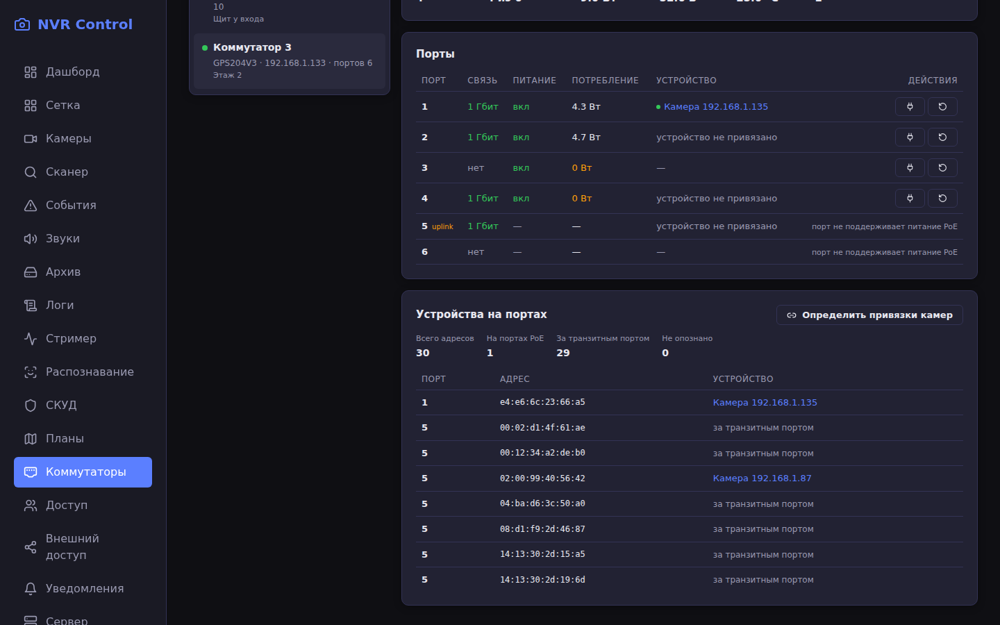
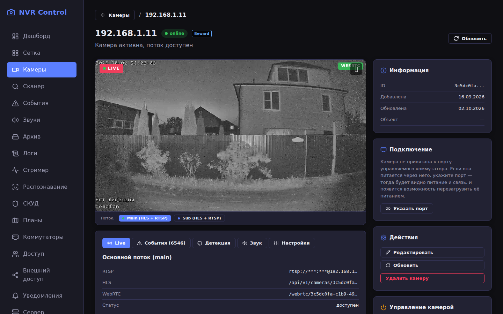

# Коммутаторы PoE

Учёт управляемых PoE-коммутаторов, мониторинг портов и управление
питанием камер.

## Зачем это нужно

Камера, помеченная «офлайн», не объясняет причину. Их три, и действия
оператора в каждом случае разные:

| Что видно на порту | Что произошло | Что помогает |
|---|---|---|
| питание есть, связь есть | камера зависла | перезагрузка питанием |
| питание есть, связи нет | обрыв линии или отказ порта | перезагрузка не поможет |
| питания нет | камера обесточена | включить питание |

Без данных с коммутатора все три случая выглядят одинаково, и оператор
идёт к камере, чтобы снять и вставить разъём. С данными о порту решение
принимается из интерфейса, а на зависшей камере достаточно нажать
«Перезагрузить питанием».

Второе, что даёт подсистема: коммутатор видит потребление в ваттах на
каждом порту. Ноль при включённом питании означает, что устройство не
берёт мощность, а растущее потребление часто предшествует отказу.

## Обнаружение и связь

Коммутаторы ищутся широковещательным запросом в мультикаст
`239.0.0.100:10086`. Устройство отвечает серийным номером, адресом,
MAC и моделью — этого достаточно для добавления, и адрес знать заранее
не нужно.

Серийный номер, а не адрес, служит идентификатором: адрес меняется по
DHCP, номер — нет.

**Недоступность по ICMP ничего не значит.** Один из коммутаторов парка
не отвечает на `ping` и значится в ARP как `INCOMPLETE`, но на поиск
отвечает штатно и работает. Проверять наличие устройства нужно только
поиском.

Транспорт — локальный UDP-протокол самих устройств: он работает без
установки дополнительных служб, не требует облака и не зависит от
веб-интерфейса коммутатора. Полезная нагрузка зашифрована блочным
алгоритмом с ключом, зашитым в устройство.

## Модели ведут себя по-разному

Одна линейка устройств, но поведение различается, и это выяснено на
живом оборудовании, а не взято из описания:

| Модель | Вход | Температура |
|---|---|---|
| PS204 | не требуется | поле `tp` |
| GPS204V3 | требуется пароль | поле `T` (в `tp` лежит мусор) |
| PS208GV3 | требуется пароль | поле `T` |

Из этого следуют два правила.

**Пароль задаётся в настройках коммутатора и не обязателен.** Если
устройство требует вход, оно отвечает текстом «требуется проверка
пароля» — это не сбой связи, а состояние устройства. Различать эти
случаи обязательно: за общим «нет связи» скроются и выключенный
коммутатор, и неверный пароль, а действия разные.

**Поля ответа различаются по моделям**, набор массивов и их длина — тоже.
Общее число портов берётся из массива линков, а число портов с PoE — из
массива питания: у GPS204V3 портов шесть, а питание есть только на
четырёх, поэтому опора не на тот массив показала бы лишние порты или
скрыла существующие.

## Управление питанием

Доступны четыре действия: включить питание, выключить, перезагрузить
(снять и подать снова с паузой) и режим удлинения линии.

Перед отправкой команды выполняются три проверки:

**Порт должен уметь питать.** На транзитных портах питание не отдаётся,
команда на них бессмысленна.

**Порт не должен быть транзитным.** Через восходящий порт идёт канал
связи с сервером. Выключив на нём питание, мы потеряем управление всем
коммутатором — включая возможность подать питание обратно. Признак
приходит от устройства битовой маской и хранится в базе, чтобы отказ
выдавался до обращения к устройству.

**Порт должен существовать.** Перезагрузка ушла бы «в пустоту», а
оператор считал бы камеру перезагруженной и ждал результата.

Перезагрузка выполняется как две команды с паузой: составной команды у
устройств нет. Пауза нужна, чтобы устройство успело разрядиться и
начать загрузку заново — при слишком короткой камера не заметит пропажу
питания.

Действия с питанием требуют подтверждения: кнопка стоит рядом с
безобидной, а нажатие стоит минуты простоя.

## Порядок нумерации портов

У части моделей первый порт на корпусе соответствует последнему элементу
в ответе устройства. Порядок определяется по серийному номеру при
добавлении и **хранится в настройках с возможностью правки**.

Разворачиваются **только порты PoE**, а транзитные остаются на своих
местах в конце — так они и подписаны на корпусе. Правило снято с самого
устройства, а не выведено рассуждением: в веб-интерфейсе GPS204V3 набор
`portIndex` равен `[3,2,1,0]` при четырёх портах PoE, а у PS208GV3 —
`[0..7]`, то есть без разворота.

Это не перестраховка. Правило производителем не документировано; на новой
модели оно может не сработать, а ошибка здесь означает команду не на тот
порт — то есть оператор обесточит исправную камеру вместо зависшей.
Сохранённое значение можно исправить, вычисляемое на месте — нет.

Число портов PoE хранится отдельно от общего числа портов: без него
неизвестно, где кончаются PoE-порты и начинаются транзитные, а от этого
зависит весь пересчёт номера.

## Устройства на портах: таблица MAC

Коммутатор ведёт таблицу MAC-адресов и сообщает, через какой порт виден
каждый адрес. Это позволяет определять привязку камер автоматически — по
совпадению адреса камеры из базы с записью в таблице.

### Как читается порт

Порт в таблице закодирован битовой маской: бит N означает порт с
индексом N, причём сначала идут порты PoE, а затем транзитные. Это
проверено не по документации, а опытом на живом устройстве: снятие
питания с порта убрало из таблицы ровно ту запись, которой
соответствовал этот бит, и только её.

### Модели ведут себя по-разному

| Состояние | Что означает | Что видит оператор |
|---|---|---|
| `ok` | порты сообщаются | привязки определяются автоматически |
| `no_ports` | таблица есть, порт не указан | адреса видны, привязки задаются вручную |
| `unsupported` | команда не поддерживается | раздел объясняет, почему привязок нет |

Состояние показывается прямо на странице: неактивная кнопка без причины
заставила бы искать её наугад. На живом парке встретились все три случая,
причём на одном из коммутаторов прошивка отдаёт одинаковую маску всем
записям — включая устройства на собственных PoE-портах. Сохранять такие
адреса всё равно полезно: видно, какие устройства на коммутаторе есть.

### Что не предлагается

Правила отбора намеренно узкие, потому что цена ошибки высока: неверная
привязка приведёт к перезагрузке питания не той камеры.

- Адрес должен быть виден ровно с одного порта. За неуправляемым
  концентратором устройство видно с нескольких портов сразу — угадывать
  нельзя.
- Порт не должен быть транзитным: через него видно чужие устройства, а
  самой камеры там нет.
- Адрес должен принадлежать ровно одной камере проекта.

Если привязка у камеры уже есть и указывает на другой порт, предложение
всё равно формируется, но с указанием прежнего: оператор должен видеть,
что привязка сдвинется, а не появится впервые.

### Применение

Список предложений заново собирается сервером при применении, а не
принимается от клиента: между показом и применением таблица MAC могла
измениться, а неверная привязка приводит к перезагрузке не той камеры.

> **Внимание при обновлении.** Исправление правила нумерации портов меняет
> смысл уже сохранённых привязок на моделях с обратным порядком. Привязки,
> созданные до обновления, нужно проверить и при необходимости задать
> заново.

## Привязка камер к портам

Камера привязывается к паре «коммутатор + номер порта» в своей карточке,
блок «Подключение». Автоматически определить принадлежность нельзя:
коммутатор не отдаёт таблицу MAC-адресов по портам, поэтому привязка
задаётся вручную.

Блок показывает состояние порта и, сопоставив его с состоянием камеры,
выдаёт вывод, а не два числа рядом:

- питание и связь есть, камера молчит — **зависла**, поможет перезагрузка;
- питание есть, связи нет — **обрыв линии**, перезагрузка не поможет;
- питания нет — камера обесточена;
- питание включено, потребления нет — устройство не берёт мощность.

Порт обязан существовать: привязка к несуществующему порту отвергается.

## Опрос

Состояние портов обновляется раз в минуту фоновым опросом, независимо от
того, открыт ли интерфейс. Это нужно в момент разбора происшествия, когда
страницу ещё никто не открыл. Есть и внеочередной опрос из карточки.

При недоступности коммутатора состояние портов **не обнуляется**: оно
остаётся с прошлого успешного опроса, а в интерфейсе появляется
предупреждение, что данные могут быть устаревшими. Обнуление выглядело бы
как «все камеры пропали» и уводило бы поиск неисправности в другую
сторону.

## Журнал

Каждое действие с портом записывается: кто, когда, на каком порту, что
сделал и чем закончилось. Журнал нужен, чтобы при разборе инцидента
отличить отказ камеры от последствий чужой перезагрузки — «камера
пропала на 40 минут» и «камеру перезагрузили в 14:20» это разные истории.

Имя камеры в записи подставляется соединением с текущей привязкой, а не
хранится. Ограничение: если привязку позже изменили, журнал покажет
нынешнюю камеру на этом порту, а не ту, к которой относилось действие.
Источник истины — текущая схема подключения.

## API

Все маршруты требуют авторизации.

| Метод | Путь | Назначение |
|---|---|---|
| GET | `/api/v1/switches` | список коммутаторов |
| GET | `/api/v1/switches/search` | поиск в сети (до 3 секунд) |
| POST | `/api/v1/switches` | добавление по серийному номеру |
| GET | `/api/v1/switches/{id}` | коммутатор с портами |
| PUT | `/api/v1/switches/{id}` | имя, расположение, пароль, порядок портов |
| DELETE | `/api/v1/switches/{id}` | удаление |
| POST | `/api/v1/switches/{id}/poll` | внеочередной опрос |
| POST | `/api/v1/switches/{id}/ports/{port}/action` | действие над портом |
| GET | `/api/v1/switches/events` | журнал действий |
| GET | `/api/v1/switches/{id}/mac` | таблица MAC-адресов |
| GET | `/api/v1/switches/{id}/bind-proposals` | предложения привязки камер |
| POST | `/api/v1/switches/{id}/bind-proposals/apply` | применить предложения |
| POST | `/api/v1/switches/bind` | привязка камеры к порту |
| GET | `/api/v1/cameras/{id}/switch-link` | подключение камеры |
| DELETE | `/api/v1/cameras/{id}/switch-link` | снятие привязки |

Действие над портом передаётся строкой (`power_cycle`, `power_on`,
`power_off`, `extend_on`, `extend_off`), а не числовым кодом устройства.
Числовые коды клиенту недоступны намеренно: среди них есть операции,
которые нельзя выполнять случайно.

## Ограничения

**Привязка определяется по таблице MAC там, где модель её отдаёт.** На
моделях с состоянием `no_ports` или `unsupported` связь «камера — порт»
задаётся вручную. Следствие: при смене порта камеру нужно перепривязать.

**У камеры должен быть заполнен MAC.** Сопоставление идёт по адресу: без
него камера не найдётся в таблице, и привязка не определится. У части
камер адрес не заполнен — их можно указать вручную или определить
сканированием.

**При удалении коммутатора привязки снимаются** вместе с ним, и сведения
о том, где камеры были подключены, теряются. Если камеры к коммутатору
привязаны, удаление отклоняется — сначала нужно осознанно снять привязки.

**Журнал показывает текущую привязку**, а не ту, что была на момент
действия (см. выше).

**Пароль хранится в открытом виде.** Он не проверяется нами, а
пересылается устройству как есть — протокол не предусматривает иначе.
Шифрование сделало бы отправку невозможной, а не безопасной.
