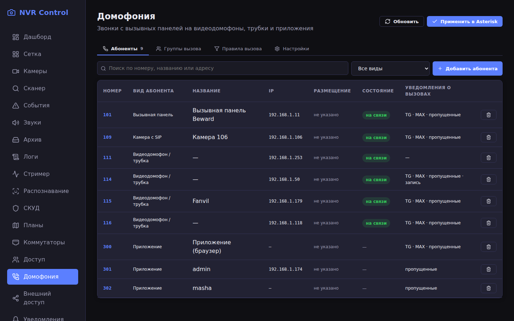
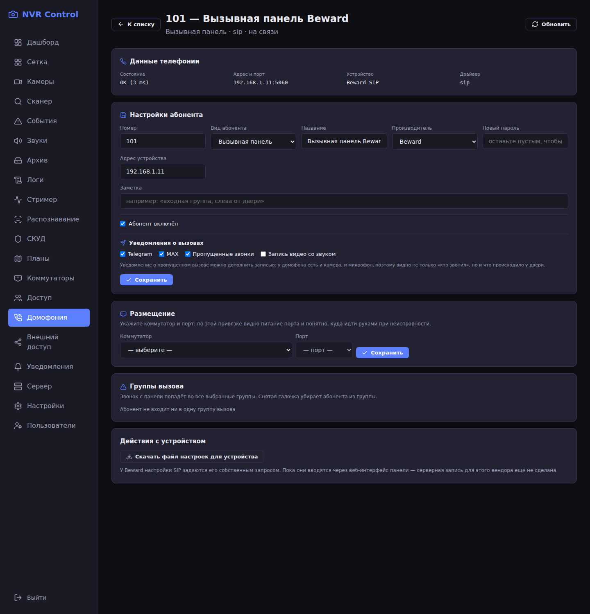
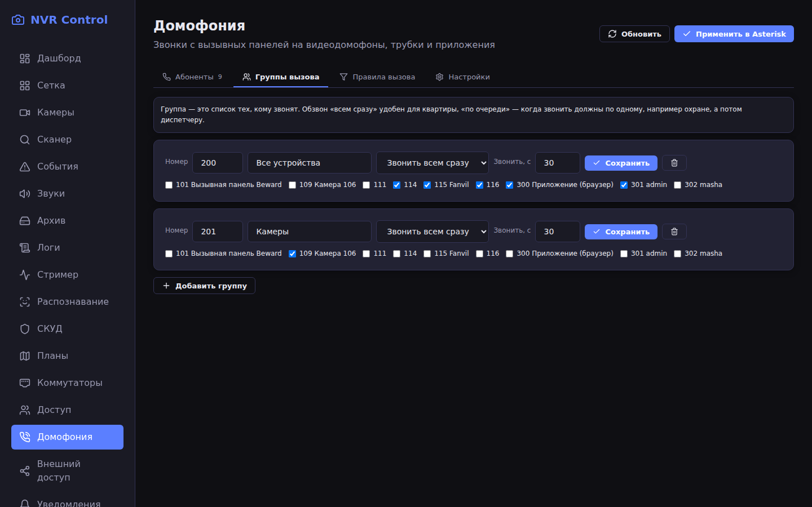
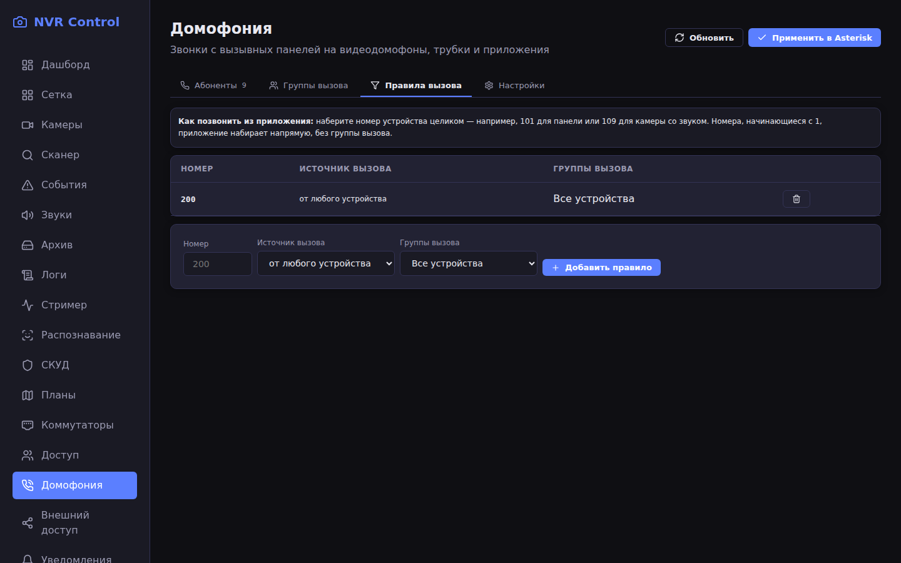
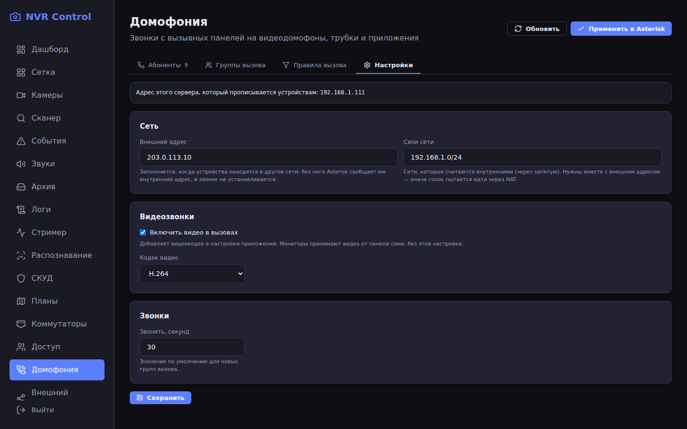

# Домофония (SIP-звонки)

Домофония в NVR — это свой телефонный сервер на базе **Asterisk**: вызывные
панели, видеодомофоны, трубки и приложения (телефон, браузер, десктоп) звонят
друг другу и в группы вызова. Отдельный сервис не нужен — Asterisk поднимается
профилем `sip` в том же `docker-compose.yml`.



## Как это устроено

| Кто | Драйвер Asterisk | Почему так |
|---|---|---|
| Панели, видеодомофоны, трубки, камеры с SIP | `chan_sip` (`sip.conf`) | С новым драйвером (chan_pjsip) панели и видеодомофоны работают некорректно — проверено на оборудовании |
| Приложения: браузер, мобильное, десктоп | `chan_pjsip` (`pjsip.conf`) | Только он умеет SIP over WebSocket, без которого WebRTC-приложению не подключиться |

Сервер сам собирает конфигурацию Asterisk из своей базы: файлы лежат в
`asterisk/config/accounts/` и перезаписываются при сохранении настроек
(кнопка «Применить в Asterisk» перечитывает их без разрыва звонков).

### Нумерация

| Диапазон | Кому |
|---|---|
| `1XX` — `101`, `109`, `114`… | устройства: панели, камеры со звуком, видеодомофоны, трубки |
| `2XX` — `200`, `201`… | группы вызова: номер группы набирают, чтобы позвать всех её участников |
| `3XX` — `301`, `302`… | приложения: каждому пользователю сервера выдаётся своя линия |

Диапазоны разделены не для красоты: по номеру сразу видно, кто звонит, и звонок
идёт нужным драйвером.

## Включение телефонии

```bash
# в каталоге проекта
docker compose --profile sip up -d
```

При первом запуске стоит задать пароль AMI (через него сервер перечитывает
конфигурацию): переменная `ASTERISK_AMI_SECRET` в `.env`. Порт WebSocket тоже
настраивается переменной — `ASTERISK_WS_PORT` (по умолчанию `8088`).

## Настройка в интерфейсе

Раздел **Домофония** состоит из четырёх вкладок.

### 1. Абоненты

Кто звонит и кому звонят. Кнопка «Добавить абонента»: номер, вид (панель,
камера, видеодомофон, приложение), название, пароль. Вид определяет драйвер —
ошибиться здесь значит получить неработающий звонок.

У каждого абонента есть карточка (`Домофония → Абоненты → номер`):



- **Данные телефонии** — то, что видит Asterisk: состояние (`OK (1 ms)`), адрес
  с портом, модель устройства, драйвер. Это данные самой станции, а не нашей
  базы: по ним видно, то ли устройство стоит на этом номере.
- **Настройки** — номер, вид, название, пароль, производитель, адрес
  устройства, заметка, включение и уведомления о вызовах.
- **Размещение** — коммутатор и порт: по ним понятно, где искать устройство и
  что с его питанием.
- **Группы вызова** — в каких группах состоит абонент.
- **Действия с устройством** — зависят от производителя: у Fanvil можно
  скачать файл настроек линии или записать его в трубку по сети; у Dahua,
  OpenIPC и Beward показано, где править SIP в самом устройстве.

Адрес устройства сервер подставляет сам из регистрации Asterisk — вписывать его
руками нужно только если устройство молчит.

### 2. Группы вызова

Кому звонить, когда набран номер группы.



У группы есть **номер** (то, что набирают с устройства), название, стратегия
обзвона (всем сразу или по очереди) и состав — галочками. Группа без номера
работает только через правило вызова, и об этом написано прямо в карточке.

### 3. Правила вызова

Какое набранное сочетание клавиш в какую группу звонит. Источник можно не
указывать — тогда правило работает для всех. Нужны там, где номер группы не
подходит: например, панель звонит «всем» по своей кнопке вызова.



### 4. Настройки



- **Внешний адрес** — адрес сервера, который прописывается устройствам, когда
  они находятся в другой сети (за роутером). Для работы только внутри дома не
  нужен и даже вреден.
- **Свои сети** — какие сети считать внутренними. Указывать **сетью**, а не
  одним адресом: `192.168.1.0/24`. Если указать `192.168.1.111`, станция
  посчитает «своим» только сам сервер и всем остальным подставит внешний
  адрес — звонки будут работать нестабильно, а видео может не идти вовсе.
- **Видеозвонки** — разрешить видео и выбрать кодек. Для устройств подходит
  `h264`: они его отдают; `vp8`/`vp9` понимают только приложения.
- **Звонить, с** — сколько секунд звонить, прежде чем считать вызов
  пропущенным.

После правок нажмите **«Применить в Asterisk»** — станция перечитает файлы.

## Пропущенные вызовы: уведомления и журнал

Сервер слушает звонки прямо в Asterisk и знает, чем закончился каждый
вызов. О неудачных он сообщает в Telegram и MAX, а все вызовы пишет
в журнал — вкладка **«Журнал звонков»** на странице «Домофония».

**Что считается пропущенным.** Неудачная попытка дозвона: не ответили,
занято или устройство недоступно. Если звонок шёл в группу из трёх трубок
и никто не снял, сообщений будет три — по одному на каждую попытку.

**Куда сообщать.** В карточке абонента, **с которого звонят** (обычно это
вызывная панель), есть галочки: «Пропущенные звонки», «Telegram», «MAX».
То есть у панели у калитки может быть свой чат, а у трубки в офисе — свой.
Каналы Telegram и MAX должны быть включены в настройках уведомлений.

**Запись вызова.** Галочка «Запись вызова» записывает момент звонка и то,
что происходило после него, и прикладывает видео к сообщению. Нужно, чтобы
у абонента была указана привязанная камера (карточка абонента → камера
устройства). Сейчас пишется только видео — звук с панели в архив не
попадает (см. `plans/sip-intercom-plan.md`).

**Журнал.** Вкладка показывает список вызовов: когда, кто звонил, куда,
чем закончилось и сколько длился разговор. По умолчанию видны только
неудачные — это самый частый вопрос; переключателем можно показать все.

**Что нужно на сервере.** Пользователю AMI `nvr` в `manager.conf` нужна
категория `call`: без неё сервер видит состав абонентов, но не сами
звонки. Установщик (`install.sh --sip`) пишет её сам; на уже настроенной
установке добавьте её в строку `read` и выполните
`asterisk -rx "manager reload"`.

## Абоненты: как заводить устройства

### Fanvil (трубки i501 и подобные)

Настраиваются **по сети прямо из интерфейса**: в карточке абонента укажите
логин и пароль веб-интерфейса трубки и нажмите «Записать в устройство». Сервер
возьмёт номер и пароль из базы и запишет их в трубку. Проверено на живых
аппаратах: настройки применяются и читаются обратно.

### Dahua (видеодомофоны TI-3430WP и подобные)

Веб-интерфейс закрыт, автонастройка невозможна: SIP задаётся **в меню самого
монитора**. В карточке абонента сервер честно об этом скажет.

### OpenIPC / Majestic (камеры со звуком)

Настройки SIP живут в разделе `sip` конфигурации Majestic и применяются
**только после перезагрузки** камеры. Камера в звонке отдаёт только звук:
видео у неё смотрится отдельным потоком в разделе «Камеры».

### Beward (вызывные панели)

Настраиваются CGI-запросом панели (`sip_cgi`). Важно: панель открывает дверь
по коду, переданному в сообщении **SIP INFO**, поэтому в конфигурации
устройства ей ставится `dtmfmode=info` — это делает сервер автоматически для
производителя `beward`.

## Приложения: звонки с телефона

Любому пользователю сервера линия выдаётся **автоматически**: номер из
свободных `3XX`, свой пароль (не пароль от входа в систему). Мобильное
приложение забирает реквизиты само при входе — настраивать ничего не нужно.

Что умеет приложение:

- исходящий звонок на устройство, группу или другого пользователя;
- приём вызова, в том числе **при заблокированном экране**;
- видео, если его отдаёт вызывающее устройство;
- громкая связь, отключение микрофона;
- кнопка **«Открыть дверь»** — отправляет код `123#` на панель (и клавиатура
  для ручного набора любого кода).

Чтобы вызовы доходили в фоне, приложение просит разрешение «работать без
ограничений» и держит постоянное уведомление. На телефонах TECNO, Xiaomi,
Huawei и подобных дополнительно нужно:

1. разрешить **автозапуск** приложения (в «Диспетчере телефона»/«Безопасности»);
2. в разделе батареи выбрать **без ограничений** для приложения;
3. **закрепить** приложение в списке недавних задач (значок замка).

Без этого прошивка «замораживает» приложение через несколько секунд после
ухода в фон — вызов придёт только после разблокировки. Подробности в
[MOBILE.md](MOBILE.md).

### Звонок с телефона на телефон

Каждый пользователь получает **свой** номер, поэтому телефоны звонят друг
другу напрямую: наберите номер коллеги (`302`) или найдите его в списке
абонентов на экране «Звонки». Правило `_3XX` в контексте `from-apps`
разрешает такой набор; без него второе приложение в сети как будто
отсутствует.

Важно: на каждом телефоне нужна **своя учётная запись**. Линия выдаётся
пользователю, а не устройству, и если войти одинаково на двух телефонах,
оба получат один номер — входящие будут «прыгать» между аппаратами, а
звонок себе самому завершится ничем.

Для видео при ответе нужно выданное разрешение камеры. Если его нет,
приложение отвечает только со звуком — так и задумано (человека у двери
надо слышать даже без картинки).

## Порты

### Внутренняя сеть (между сервером и устройствами/телефонами)

| Порт | Протокол | Назначение |
|---|---|---|
| `5060` | UDP | SIP для устройств (панели, трубки, видеодомофоны) |
| `8088` | TCP | SIP over WebSocket для приложений + HTTP-сервер Asterisk |
| `10000–10100` | UDP | голос и видео звонка (RTP) |
| `3001` | TCP | веб-интерфейс (он же проксирует `/api/`, `/mse/`, `/ws`) |
| `8080` | TCP | REST API (им пользуется мобильное приложение) |
| `8555` | TCP+UDP | медиа WebRTC для live-просмотра камер |
| `9784` | TCP | внешний RTSP-доступ к камерам |

### Работа из внешней сети (проброс на роутере)

Если приложением пользуются **не только внутри дома**, на роутере
пробрасываются:

| Наружу | Внутренний адрес | Зачем |
|---|---|---|
| `5060/udp` | `сервер:5060` | чтобы внешние SIP-устройства могли зарегистрироваться |
| `8088/tcp` | `сервер:8088` | WebSocket приложений: без него телефон не зарегистрируется |
| `10000–10100/udp` | `сервер:10000–10100` | голос и видео во время звонка |
| `3001/tcp` | `сервер:3001` | веб-интерфейс |
| `8080/tcp` | `сервер:8080` | API для мобильного приложения |
| `8555/tcp+udp` | `сервер:8555` | видео просмотра камер (WebRTC) |

После этого в **Домофония → Настройки** укажите:

- «Внешний адрес» — публичный адрес или домен (например, `nvr.example.ru`);
- «Свои сети» — локальную сеть **сетью**: `192.168.1.0/24`.

Так локальные устройства получат локальный адрес, а внешние — внешний; без
разделения голос пытается идти через NAT и связь рвётся.

Проверить, что наружу всё доступно, можно с телефона в мобильной сети: войти в
приложение и позвонить на панель. Если не выходит — почти всегда закрыт
`8088/tcp` (нет регистрации) или диапазон RTP (звонок идёт, но нет звука).

## Диагностика

Быстрая проверка линии приложения без телефона:

```bash
node scripts/check-sip-line.js 301 ПАРОЛЬ_ЛИНИИ
# → РЕГИСТРАЦИЯ: линия 301 на связи (ws://192.168.1.111:8088/ws)
```

Полезные команды станции:

```bash
docker exec gigacode-asterisk-1 asterisk -rx "sip show peers"      # устройства
docker exec gigacode-asterisk-1 asterisk -rx "pjsip show contacts" # приложения
docker exec gigacode-asterisk-1 asterisk -rx "dialplan show from-devices"
docker exec gigacode-asterisk-1 asterisk -rx "dialplan show from-apps"
```

### Частые случаи

| Симптом | Причина | Что делать |
|---|---|---|
| Звонок срывается сразу после набора, в логе `No format found to offer` | у приложения разрешён кодек, которого нет у устройства (например `opus`) | в настройках оставить `alaw,ulaw` для голоса; сервер ставит их сам |
| Нет видео с панели на телефон | у устройств запрещено видео на станции | в `asterisk/config/sip.conf` у шаблона устройства должны быть `allow=…,h264` и `videosupport=yes`; после правки — **перезапуск** Asterisk (не `reload`) |
| В логе `Contents of sip.conf are invalid` и пропали все устройства | файлы настроек недоступны Asterisk на чтение | права на `asterisk/config/accounts/*.conf` должны быть `644`; сервер выставляет их сам |
| Телефон «постоянно переподключается» | пропал WS-транспорт при пересборке конфигурации | у `[transport-ws]` в `pjsip.conf` обязателен `bind=0.0.0.0:8088` |
| Код открытия двери не срабатывает | DTMF идёт как SIP INFO, а станция его не принимала | у приложений `dtmf_mode=auto_info`, у панели Beward `dtmfmode=info` |
| Вызов не приходит при заблокированном экране | прошивка замораживает приложение | разрешения на автозапуск/батарею (см. выше) и полноэкранное уведомление в приложении |
| Звонок в группу с приложения не проходит, с панели — проходит | правила групп подключены только в контекст устройств | `#include accounts/extensions_accounts.conf` должен быть и в `[from-devices]`, и в `[from-apps]` |

| Звонок с приложения в группу обрывается сразу после набора, в логе `Set(CALLLIST=…)` с мусором вместо каналов | в Asterisk `REPLACE()` удаляет **символы**, а не подстроку, и список целей портился | исправлено в генераторе плана (`writeDialplanRule`, перебор `CUT` + `While`); если видите этот симптом — обновите сервер |
| Телефону «звонит» он сам, когда звоните в группу, куда входит ваша линия | звонящий не исключался из списка обзвона | исправлено там же — звонящий вычитается из списка; обновите сервер |
| Односторонний звук с панели | панель рекламирует в SDP внешний адрес, а `nat=no` заставляет слать голос туда | в `asterisk/config/sip.conf` должно быть `nat=force_rport,comedia` в `[general]` и `[device](!)` |
| Вызов обрывается сразу после набора, в логе `486 Busy Here` | устройство отвечает «занято»: на трубке остался незавершённый вызов | перезагрузить трубку (Fanvil i501 отвечает `486`, `Q.850 cause=17`) |
| Нет видео при звонке с телефона на телефон либо картинка только у одного | отвечающему приложению не выдано разрешение камеры | выдать разрешение в настройках системы и позвонить снова |
| Звонок из приложения обрывается через несколько секунд после ответа | приложение вело только одну сессию, и отмена второго вызова сбрасывала разговор | исправлено в приложении: лишний вызов отклоняется, события сверяются со своей сессией |

Больше симптомов — в [TROUBLESHOOTING.md](TROUBLESHOOTING.md).

## Что проверено на живом оборудовании

- **Панель Beward** (`101`) — звонки, DTMF-код открытия двери, видео в звонке.
- **Видеодомофоны Dahua** (`116`) и **трубки Fanvil** (`114`, `115`) — звонки,
  видео, автонастройка (Fanvil).
- **Камеры OpenIPC / Majestic** (`109`) — звонок со звуком; видео по SIP камера
  не отдаёт.
- **Мобильное приложение** — регистрация по WebSocket, приём вызова в фоне и
  на заблокированном экране, видео, громкая связь, открытие двери по `123#`.
  Проверены звонки телефон — телефон (`301` ↔ `302`) со звуком и видео
  в обе стороны; при исходящем вызове слышны гудки ожидания.
- **Компьютерный софтфон** — работает как обычное устройство (`111`).

## Ограничения

- Asterisk **не перекодирует видео**: картинка идёт «как есть», поэтому кодек
  должен совпадать у обоих концов (`h264` понимают и устройства, и приложения).
- Видео между WebRTC-приложением и обычным SIP-устройством работает не на всех
  прошивках устройств. Если у устройства нет стабильного SIP-видео, картинку из
  звонка можно смотреть отдельным потоком в разделе «Камеры».
- Пропущенные вызовы пока только отмечаются (галочки уведомлений); запись
  видео и отправка сообщения по пропущенному — в планах
  (`plans/sip-intercom-plan.md`).
